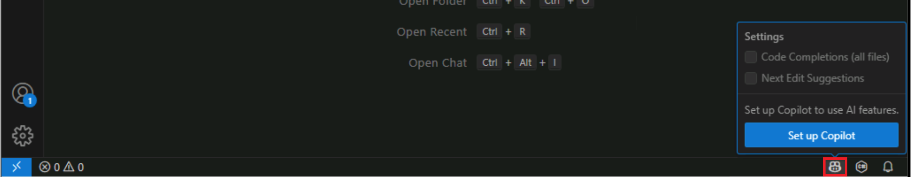

---
lab:
  title: 準備 - Visual Studio Code で GitHub Copilot を有効にする
  description: Visual Studio Code で GitHub Copilot を有効にするために必要な手順を済ませます。
---

# Visual Studio Code で GitHub Copilot を有効にする

GitHub には、個人開発者向けの 3 つの GitHub Copilot プランと、organization および Enterprise 向けの 2 つのプランがあります。 これらのプランは、個々の開発者、チーム、organization のニーズを満たすように作られています。 GitHub Copilot Free プランは個々の GitHub ユーザーが利用でき、有料プランはさらに多くの機能を必要とする個人や organization が利用できます。

Visual Studio Code で GitHub Copilot を有効にするには、以下の手順のようにします。

1. Visual Studio Code を開きます。

1. Visual Studio Code の最新バージョンがインストールされていることを確認します。

    更新プログラムを確認するには、Visual Studio Code ウィンドウの左下隅にある **[管理]** (歯車アイコン) を選んでから、**[更新の確認]** を選びます。

1. GitHub Copilot をアクティブにするには、Visual Studio Code のステータス バーで Copilot アイコンをポイントして、**[Copilot の設定]** を選びます。

    

1. **[サインインして Copilot を無料で使用する]** ページで、**[サインイン]** を選びます。

    既定の Web ブラウザーで GitHub アカウントのサインイン ページが開きます。

1. GitHub のサインイン ページで、この演習で使う GitHub アカウントの資格情報を入力して、**[サインイン]** を選びます。

1. オンラインの手順に従ってアカウントの認証を行い、Visual Studio Code でアクセスを認可します。

    認証と認可のプロセスが済むと、Visual Studio Code に戻ります。

1. GitHub Copilot がアクティブになっていることを確認するには、Visual Studio Code の **[拡張機能]** ビューを開きます。

    [拡張機能] ビューの **[インストール済み]** セクションの一覧に、GitHub Copilot と GitHub Copilot Chat 拡張機能が表示されているはずです。

    ![Visual Studio Code の [拡張機能] ビューでの GitHub Copilot を示すスクリーンショット。](./Media/m00-github-copilot-extensions-vscode.png)
