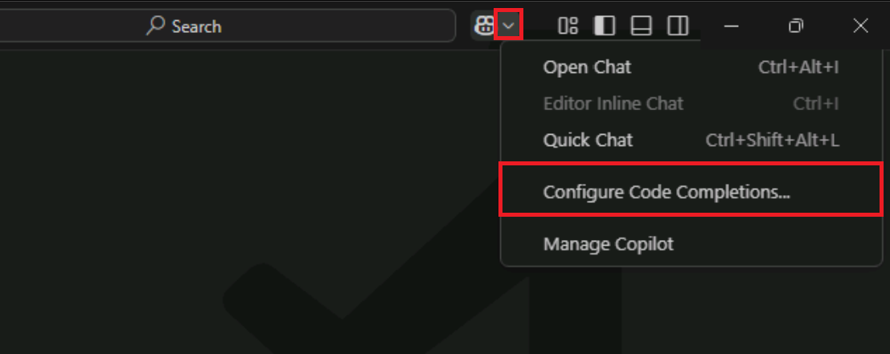
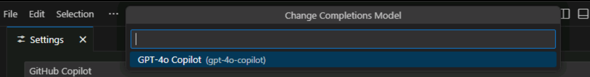
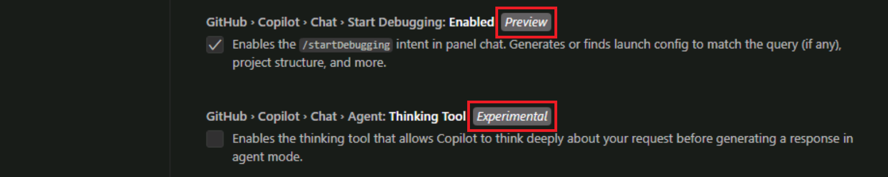
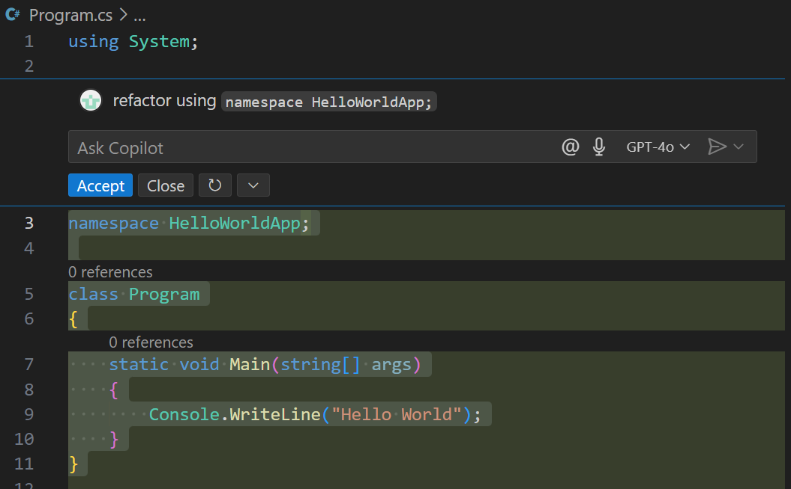

---
lab:
  title: 演習 - GitHub Copilot の設定とユーザー インターフェイスの機能を確認する
  description: GitHub Copilot の設定を構成する方法と、Visual Studio Code で GitHub Copilot 機能にアクセスする方法について説明します。
---

# GitHub Copilot の設定とユーザー インターフェイスの機能を確認する

Visual Studio Code は、開発者向けのシームレスかつカスタマイズ可能な GitHub Copilot 環境として機能します。 この演習では、GitHub Copilot の設定を確認し、Visual Studio Code の GitHub Copilot ユーザー インターフェイスについて見ていきます。

この演習の完了に要する時間は約 **25** 分です。

> **重要**:この演習を完了するには、自分の GitHub アカウントと GitHub Copilot サブスクリプションを用意する必要があります。 GitHub アカウントをお持ちでない場合は、無料の個人用アカウントに<a href="https://github.com/" target="_blank">サインアップ</a>し、GitHub Copilot Free プランを使用して演習を完了できます。 ラボ環境内から GitHub Copilot Pro、GitHub Copilot Pro+、GitHub Copilot Business、または GitHub Copilot Enterprise サブスクリプションにアクセスできる場合は、既存の GitHub Copilot サブスクリプションを使用してこの演習を完了できます。

## 開始する前に

ラボ環境には次のものが必要です。

- Git 2.48 以降
- .NET または Python のいずれか:

    -  **.NET SDK 9.0** 以降と、**C# 開発キット**拡張機能をインストールした Visual Studio Code。
    - **Python 3.10** 以降と、**Python** 拡張機能をインストールした Visual Studio Code

- GitHub Copilot が有効になっている GitHub アカウントへのアクセス。

この演習のラボ環境としてローカル PC を使用している場合:

- ローカル PC をラボ環境として構成する方法については、ブラウザーで次のリンクを開いてください: <a href="https://go.microsoft.com/fwlink/?linkid=2320147" target="_blank">ラボ環境のリソースを構成する</a>。

- Visual Studio Code で GitHub Copilot サブスクリプションを有効にする方法については、ブラウザーで次のリンクを開いてください: <a href="https://go.microsoft.com/fwlink/?linkid=2320158" target="_blank">Visual Studio Code で GitHub Copilot を有効にする</a>。

この演習に、ホストされたラボ環境をお使いの場合:

- Visual Studio Code で GitHub Copilot サブスクリプションを有効にする方法については、次の URL をブラウザーのサイト ナビゲーション バーに貼り付けてください: <a href="https://go.microsoft.com/fwlink/?linkid=2320158" target="_blank">Visual Studio Code で GitHub Copilot を有効にする</a>。

- コマンド ターミナルを開き、次のコマンドを実行します。

    Visual Studio Code が正しいバージョンの **.NET** を使用するように構成されていることを確認するには、次のコマンドを実行します。

    ```bash

    dotnet nuget add source https://api.nuget.org/v3/index.json -n nuget.org

    ```
    
    または

    Visual Studio Code が正しいバージョンの Python を使用するように構成されていることを確認するには、Python インストールがバージョン 3.10 以降であることを確認します。

    ```bash
    python --version
    ```

## 演習のシナリオ

あなたは地域コミュニティの IT 部署で働く開発者です。 公共図書館を支えるバックエンド システムが火災で失われました。 システムが置き換えられるまで、チームは図書館スタッフが業務を管理できるようにするための一時的なソリューションを開発する必要があります。 チームは、開発プロセスをスピードアップするために GitHub Copilot を選びました。

この演習には、次のタスクが含まれています。

1. Visual Studio Code で GitHub Copilot の設定を確認する。
1. Visual Studio Code で GitHub Copilot ユーザー インターフェイスを確認する。

## Visual Studio Code で GitHub Copilot の設定を確認する

GitHub Copilot の設定は、GitHub アカウントと Visual Studio Code 環境に分かれています。 Visual Studio Code では、設定を使用して GitHub Copilot と GitHub Copilot Chat の動作を構成できます。 GitHub アカウントでは、設定を使用して GitHub Copilot サブスクリプションを管理し、プロンプトと提案の保持を構成し、パブリック コードに一致する提案を許可またはブロックすることができます。

### Visual Studio Code で GitHub Copilot を有効または無効にする

プランをアクティブにすると、Visual Studio Code の GitHub Copilot 拡張機能は既定で有効になります。 ただし、必要に応じて、GitHub Copilot in Visual Studio Code を一定期間無効にすることができます。

以下の手順に従って、演習のこのセクションを完了します。

1. Visual Studio Code の新しいインスタンスを開きます。

1. Visual Studio Code で、**[拡張機能]** ビューを開きます。

1. インストールされている拡張機能の一覧で、**GitHub Copilot** が見つかるまで下にスクロールします。

1. GitHub Copilot 拡張機能の [有効にする] と [無効にする] のオプションを一覧表示するドロップダウン メニューを表示するには、GitHub Copilot 拡張機能の歯車アイコンを選択します。

    

有効化/無効化オプションをテストする場合は、無効化オプションを選択できます。 ただし、この演習を続行する前に、必ず GitHub Copilot を再度有効にしてください。

### GitHub Copilot 拡張機能の設定を確認する

GitHub Copilot in Visual Studio Code をアクティブにすると、既定の設定が自動的に構成されます。 設定は [拡張機能] ラベルにまとめられており、GitHub Copilot と GitHub Copilot Chat の両方の設定が含まれています。 Visual Studio Code の設定タブを使用して、GitHub Copilot 拡張機能の設定をカスタマイズできます。

> **ヒント**:Copilot Chat メニューを使用して、GitHub Copilot 用にフィルター処理された [設定] タブを開くことができます。

以下の手順に従って、演習のこのセクションを完了します。

1. Visual Studio Code の上部のメニュー バーで、Copilot Chat メニューを開きます。

    Copilot Chat メニューには、GitHub Copilot 設定のフィルター処理された一覧にアクセスできる **[コード補完の構成]** オプションがあります。

    

1. Copilot Chat メニューの **[コード補完の構成]** を選択し、**[設定の編集]** を選択します。

1. 少し時間を取って、GitHub Copilot 設定がどのような構成かを確認しましょう。

    

    *GitHub Copilot* と *GitHub Copilot Chat* の設定が分かれていることに注目してください。 また、*[プレビュー]* と *[実験的]* のカテゴリにも注目してください。

1. [拡張機能] ラベルの **[GitHub Copilot]** を選択します。
  
    

    設定の一覧が GitHub Copilot 用にのみフィルター処理されていることに注意してください。

    GitHub Copilot 拡張機能には、次の設定オプションがあります。

    - **GitHub.Copilot.Advanced**:settings.json で GitHub Copilot の詳細設定を構成します。

        **[settings.json で編集]** を選択すると、settings.json ファイルが開きます。これは GitHub Copilot の設定が含まれる JSON ファイルです。 設定は複数のセクションに分かれており、各セクションには設定の一覧が含まれています。

        

    - **GitHub.Copilot.Enable**:指定した言語の Copilot 入力候補を有効または無効にします。

        この "*言語*" という用語はプログラミング言語を指しますが、他のファイル形式にも対応しています。 言語を指定するには、言語の一覧と、各言語に対して GitHub Copilot を有効または無効にする **true** または **false** の値を使用します。 既定では、GitHub Copilot はすべての言語で有効になっています。 この設定では、最初の行にワイルドカード文字 **\*** が使用され、**true** の値が指定されています。 後続の行では、GitHub Copilot が有効または無効になっている言語を指定します。 たとえば、GitHub Copilot を **C#**、**JavaScript**、**Python** で有効化し、**Plaintext** と **Markdown** で無効化するなどです。

        

    - **GitHub.Copilot.SelectedCompletionModel**:Copilot 入力候補に使用するモデルを選択します。

        補完モデルを選択するには、[Copilot 入力候補の構成] メニューを開き、**[補完モデルの変更]** メニュー オプションを選択します。

        ![[補完モデルの変更] メニュー オプションを示すスクリーンショット。](./Media/m01-github-copilot-extension-settings-change-completions-model-menu.png)

        モデルの一覧は、GitHub Copilot サブスクリプション、お客様のリージョンで使用できるモデル、組織で使用できるモデルによって制限される場合があります。

        

1. **[Enable or disable Copilot completions for specified languages] (指定した言語の Copilot 入力候補を有効または無効にする)** で、**[markdown]** を選択します。

    Markdown の既定値は **false** に設定されています。 これは、Markdown ファイルに対して GitHub Copilot 入力候補が無効になっていることを意味します。

1. Markdown ファイルに対して Copilot を有効にするには、**[項目の編集]** (鉛筆アイコン) を選択し、**[false]** を選択して、値を **[true]** に変更してから **[OK]** を選択します。

    GitHub Copilot を使用して Markdown ファイルを作成または更新できるようになりました。 たとえば、GitHub Copilot でプロジェクトのドキュメントを作成しているときに、コード補完の提案を生成できます。

1. [拡張機能] ラベルの [GitHub Copilot Chat] を選択します。

    

    GitHub Copilot Chat 拡張機能には使用できる設定が多数あり、定期的に更新されます。 GitHub Copilot Chat 拡張機能には、プレビューおよび実験的な設定も含まれており、変更されたり、廃止されたりする可能性があります。 プレビューおよび実験的な設定は一覧の最後に表示され、"**プレビュー**" または "**実験的**" というタグが付いています。

    

1. 少し時間を取って、GitHub Copilot Chat の設定を確認しましょう。

    このトレーニングの間は、既定の設定のままにすることをお勧めします。 そうすることで、演習に取り組む際に期待どおりの経験が得られるようになります。 トレーニングを修了した後に、これらの設定の変更を試しながら GitHub Copilot と Copilot Chat のエクスペリエンスをカスタマイズしてみてください。

1. 設定タブを閉じます。

## Visual Studio Code で GitHub Copilot ユーザー インターフェイスを確認する

Visual Studio Code により、GitHub Copilot の AI 機能を開発環境にシームレスに統合できます。

GitHub Copilot の機能は次のカテゴリに分類されます。

- 自然言語のチャット:GitHub Copilot には、3 種類のチャット インターフェイスが用意されています。チャット ビュー、クイック チャット、インライン チャットです。

- コード補完:GitHub Copilot はコード エディターと統合され、ユーザーの入力に応じてコンテキストに合うコード補完の提案が生成されます。

- スマート アクション:GitHub Copilot では、スマート アクションを使用して一般的なタスクを自動化し、プロンプトの繰り返し作成を排除しています。

GitHub Copilot の生産性機能には簡単にアクセスできます。また、コーディング エクスペリエンスを中断することなくワークフローにシームレスに適合します。

### チャット ビューの機能を確認する

以下の手順に従って、演習のこのセクションを完了します。

1. チャット ビューを開くには、**[チャットの切り替え]** ボタンを選択します。

    [チャットの切り替え] ボタンは、Visual Studio Code ウィンドウの上部、検索テキストボックスのすぐ右にあります。

    ![Copilot の [チャットの切り替え] ボタンを示すスクリーンショット。](./Media/m01-github-copilot-toggle-chat.png)

    GitHub Copilot Chat ビューは、Visual Studio Code ウィンドウの右側にあるサイド バー ウィンドウに表示されます。

1. 少し時間を取って、Chat ビュー インターフェイスを確認しましょう。

    

    上から順に説明すると、チャット ビューには次のインターフェイス要素があります。

    - チャット ビュー ツール バー:チャット ビュー ツール バーは、チャット ビューの右上隅にあります。 ツール バーを使用すると、チャット履歴を管理し、新しいチャットを開始し、別の場所でチャット ビューを表示し、チャット ビューを非表示にすることができます。 ツール バーのボタン アイコンにマウス ポインターを置くと、説明が表示されます。

    - チャット応答領域:チャット応答領域は、GitHub Copilot による応答が表示されるチャット ビュー ツール バーの下の空間です。 応答には、コードの提案、説明、対話型の要素、プロンプトに関連するその他の情報が含まれます。

    - [コンテキストの追加] ボタン:[コンテキストの追加] ボタンは、チャット ビューの下部にあります。 このボタンを使用して、Chat セッションにコンテキストを追加するリソースを検索できます。 リソースには、内部プロジェクト ファイルから、組織外部の GitHub 上にあるパブリック リポジトリまで、あらゆるものが含まれます。

    - Copilot に質問:[Copilot に質問] テキスト ボックスは、プロンプトを入力する場所です。 [Copilot に質問] テキスト ボックスを使用すると、コードベースについて GitHub Copilot に質問し、コードの提案を依頼し、特定のタスクに関する支援を依頼することができます。

    - [拡張機能とチャット] ボタン:[拡張機能とチャット] ボタンは、[Copilot に質問] テキストボックスの下にあります。 GitHub Copilot 拡張機能は、外部ツールの機能を GitHub Copilot Chat に統合する GitHub アプリの一種です。 このボタンを使用して、Copilot 拡張機能の一覧から選択できます。 既定の拡張機能には、プロンプトにコンテキストを提供するチャット参加者とスラッシュ コマンドの組み合わせが含まれています。

        > **注**:Copilot Pro、Copilot Pro+、または Copilot Free プランをご利用の方は Copilot 拡張機能を使用できます。 Copilot Business または Copilot Enterprise プランをご利用の組織または企業の場合、組織所有者とエンタープライズ管理者は Copilot 拡張機能へのアクセス権を付与できます。 Copilot 拡張機能は GitHub Enterprise Server では使用できません。

    - [ボイス チャットの開始] ボタン:[ボイス チャットの開始] ボタンは、[Copilot に質問] テキストボックスの下にあります。 このボタンを使用して、GitHub Copilot の音声操作を有効または無効にすることができます。 音声操作が有効になっている場合は、音声を使用して GitHub Copilot に質問したり、コードの提案を依頼したりできます。

    - [チャット モード] メニュー:[チャット モード] ドロップダウン メニューは、[ボイス チャットの開始] ボタンの右側にあります。 具体的なニーズに応じて、さまざまなチャット モードを選択できます。

        - **質問**:このモードを使用して、コードベースについて GitHub Copilot に質問します。 コードの説明、変更の提案、コードベースに関する情報の提供を GitHub Copilot に依頼できます。
        - **編集**:このモードを使用して、ワークスペース内のコードを編集します。 GitHub Copilot を使用して、コードをリファクターし、コメントを追加し、コードにその他の変更を加えることができます。
        - **エージェント**:このモードを使用して、GitHub Copilot をエージェントとして実行します。 GitHub Copilot を使用して、コマンドの実行、コードの実行、またはその他の各種タスクをワークスペース内で実行することができます。

    - [モデルの選択] メニュー:[モデルの選択] メニューは、[チャット モード] メニューの右側にあります。 このボタンを使用して、GitHub Copilot でコード提案を生成するときに使用するモデルを選択できます。 既定のモードは GPT-4o です。 モデルの選択は、GitHub Copilot サブスクリプション、GitHub Copilot の設定、リージョンで使用できるモデルに基づいて制限される場合があります。

    - [送信と配信] メニュー:[送信と配信] メニューは、[モデルの選択] メニューの右側にあります。 このボタンを使用して、プロンプトを GitHub Copilot に送信し、応答を受け取ることができます。 メニューには、プロンプトの送信方法に関するいくつかのオプションがあります。

1. [Copilot に質問] テキストボックスを使用して次のプロンプトを入力し、プロンプトを送信します。

    **C# の場合:**

    ```text
    Create a C# console app that prints Hello World to the console.
    ```

    **または Python の場合:**

    ```text
    Create a Python console app that prints Hello World to the console.
    ```

1. GitHub Copilot の応答には、対話型のファイル一覧と **[ワークスペースの作成]** ボタンが含まれていることに注目してください。

1. GitHub Copilot でコード プロジェクトを作成するには、**[ワークスペースの作成]** を選択します。

    GitHub Copilot から、ワークスペースを作成する前に親フォルダーの入力が求められます。

1. [ファイル] ダイアログで **[デスクトップ]** フォルダーを選択し、**[親フォルダーとして選択]** を選択します。

1. 作成されたワークスペースを開くように求められたら、**[開く]** を選択します。

    より高度なプロンプトを使用すると、複数のファイルを含むワークスペースを作成することや、異なるプロジェクトの種類を作成することができます。 たとえば、次のプロンプトを使用して、コンソール アプリ プロジェクトの追加条件を指定できます。

    **C# の場合:**

    ```text
    Create a C# console app that prints Hello World to the console. Include a .gitignore file.
    ```

    **または Python の場合:**

    ```text
    Create a Python console app that prints Hello World to the console. Include a .gitignore file.
    ```

### クイック チャット機能を確認する

クイック チャット ウィンドウは、GitHub Copilot と対話するための簡略化されたインターフェイスです。 コード エディターを離れることなく、簡単に質問したり、コードの提案を依頼したり、特定のタスクに関する支援を得たりすることができます。

1. Copilot Chat メニューを開くと、3 つのチャット オプションが表示されます。

    

    次の 3 つのチャット オプションがあります。

    - チャットを開く:このオプションは、チャット ビューを開くために使用されます。

    - エディター インライン チャット:このオプションは、コード エディターで GitHub Copilot と直接対話するために使用されます。 [インライン チャット] オプションは、エディターでファイルが開いている場合にのみ有効になります。

    - クイック チャット:このオプションは、簡略化されたインターフェイスを使用して GitHub Copilot と対話するために使用されます。 クイック チャットを使用すると、コード エディターを離れることなく質問し、コードの提案を依頼し、特定のタスクに関する支援を受けることができます。

1. Copilot Chat メニューの **[クイック チャット]** を選択します。

    既定では、クイック チャット ウィンドウは Visual Studio Code ウィンドウの上部中央に開きます。

1. クイック チャット ウィンドウには、チャット ビューと同じオプションが多数表示されることに注目してください。

1. クイック チャット ウィンドウを使用して、次のプロンプトを送信します。

    ```text
    Tell me about the Program.cs file
    ```

    コンテキストを追加しないと、応答は、さまざまなプロジェクトの種類で Program.cs ファイルがどのように使用されるかについての説明になる可能性があります。

1. Program.cs ファイルを [クイック チャット] のコンテキストに追加するには、Program.cs ファイルをエクスプローラー ビューからクイック チャット ウィンドウの上部にドラッグ アンド ドロップします。

1. クイック チャット ウィンドウの **[コンテキストの追加]** ボタンの右側に **Program.cs** が表示されることに注目してください。

    > **ヒント**:プロジェクト ファイルをチャット コンテキスト (チャット ビュー、クイック チャット、またはインライン チャット) に追加すると、GitHub Copilot からより関連性の高い提案が提示されるようになります。 プロジェクト ファイルをチャット コンテキストに追加する場合、[コンテキストの追加] ボタンではなく、ドラッグ アンド ドロップ操作を使用する方が簡単な場合がよくあります。

1. クイック チャット ウィンドウの上部までスクロールし、同じプロンプトを再送信します。

    ```text
    Tell me about the Program.cs file
    ```

1. 新しい応答では、Program.cs ファイルの使用方法に関する一般的な説明ではなく、Program.cs ファイルの内容が説明されていることに注目してください。

1. クイック チャット ウィンドウの右上にある **[チャット ビューで開く]** を選択します。

    クイック チャット ウィンドウが閉じて、クイック チャット ウィンドウに表示された応答を含むチャット ビューが開くことに注目してください。 チャット ビューに [クイック チャット] セッションが表示されない場合は、Copilot Chat メニューを使用してクイック チャット ウィンドウを開き、**[チャット ビューで開く]** を選択します。

    クイック チャット ウィンドウで開始されたチャット セッションを拡張および管理する必要がある場合は、チャット ビューに切り替えると便利です。

    > **ヒント**:クイック チャット ウィンドウは、簡単な質問や簡単なタスクに最適です。 ただし、さらに専用のチャット環境が必要な場合は、チャット ビューを使用してください。 チャット ビューには、GitHub Copilot と対話するためのより包括的なインターフェイスが用意されており、チャット履歴、ファイル管理、チャット セッションを管理するためのより高度なオプションなどの機能があります。

### インライン チャット機能を確認する

インライン チャット インターフェイスは、エディター内で直接コードを操作できるように設計されています。 コードの操作に集中できる効率的な環境を利用し、コード エディターを離れることなく質問し、コードの提案を依頼し、編集することができます。

1. エディターで Program.cs ファイルを開きます。

1. Copilot Chat メニューを開き、次の点に注目します。

    - [エディター インライン チャット] メニュー オプションが有効になっています。
    - **Ctrl+I** キーボード ショートカットを使用してインライン チャット セッションを開くことができます。

1. コード エディターで次のコードを選択します。

    ```csharp

    namespace HelloWorldApp
    {
        class Program
        {
            static void Main(string[] args)
            {
                Console.WriteLine("Hello World");
            }
        }
    }

    ```

1. インライン チャット セッションを開くには、キーボード ショートカット **Ctrl+I** キーを使用します。

1. 少し時間を取って、インライン チャット インターフェイスを確認しましょう。

    インライン チャット インターフェイスには、チャット ビューやクイック チャット インターフェイスで確認した機能も含まれていますが、エディター内で直接コードを操作できるように設計されています。

1. [Copilot に質問] テキストボックスに次のプロンプトを入力し、プロンプトを送信します。

    ```text

    refactor using `namespace HelloWorldApp;`

    ```

1. 少し時間を取って、インライン チャットによって生成された応答を確認しましょう。

    

    次のことに注意してください。

    - インライン チャットを使用すると、コードを直接更新して提案を生成できます。
    - 提案された更新を実装する場合は **[承諾]** を選択し、選択した更新を拒否する場合は **[閉じる]** を選択し、新しい提案を生成する場合は **[再実行]** を選択できます。
    - また、インライン チャット セッションを管理するための追加オプションが表示される **[その他のアクション]** メニューもあり、提案を "役に立った" または "役に立たなかった" と評価できます。

1. 提案されたコードの更新を受け入れるには、**[承諾]** を選択します。

    ファイルスコープの名前空間構文が使用されるようにコードが更新されました。

### チャット ビューの質問モードと編集モードを比較する

チャット ビューには 3 つのモードがあります。**[質問]**、**[編集]**、**[エージェント]** です。 質問モードは質問したりコードの提案を生成したりするために設計されています。編集モードはコードのリファクタリングと編集タスクのために設計されています。 エージェント モードは、コマンドの実行とコードの実行のために設計されています。

1. チャット ビューを**質問**モードで開いていることを確認します。

1. 次のコードを選択します。

    ```csharp

    static void Main(string[] args)
    {
        Console.WriteLine("Hello World");
    }

    ```

    チャット ビューのコンテキストが更新され、Program.cs ファイル内の選択したコード行が指定されていることに注目してください。

1. チャット ビューで、次のプロンプトを入力します。

    ```text

    refactor selection to display "Generate equations for addition and subtraction:"

    ```

1. 少し時間を取って、チャット ビューに表示された応答を確認しましょう。

    

    コードの上にマウス ポインターを置くと、チャット ビューに次のオプションが表示されることに注目してください。

    - **Program.cs に適用**:[Program.cs に適用] オプションを使用して、提案されたコードの更新を Program.cs ファイルに適用します。
    - **カーソル位置に挿入**:[カーソル位置に挿入] オプションを使用して、提案されたコードの更新をエディターの現在のカーソル位置に挿入します。
    - **コピー**:[コピー] オプションを使用して、提案されたコードの更新をクリップボードにコピーします。

1. チャット ビューで **[モードの設定]** を選択し、**[編集]** を選択します。

1. チャット モードを変更すると現在のチャット セッションが終了するというメッセージが表示された場合は、**[はい]** を選択して新しいチャット セッションを開始し、次のプロンプトを再送信します。

    ```text

    refactor selection to display "Generate equations for addition and subtraction:"

    ```

1. 少し時間を取って、コード エディターで提案された更新を確認しましょう。

    

    次のことに注意してください。

    - コード エディターには、GitHub pull request で使用される Diff ビューと同様に、コードに加えられた変更を示す *Diff スタイル*のビューが表示されます。
    - コード エディターには、コードに加えられた変更を適用するか拒否するために使用できる **[保持する]** ボタンと **[元に戻す]** ボタンが表示されます。
    - コード エディターには、提案された編集を管理するために使用できる追加のボタンが表示されます。

    エディター タブに表示される編集コントロールに加えて、チャット ビューには、すべての編集を適用するために使用できる **[保持する]** ボタンと、編集を取り消す **[元に戻す]** ボタン、提案された更新の簡潔な説明が表示されます。

1. チャット ビューで **[保持する]** を選択し、提案されたコードの更新を適用します。

> **注**:チャット ビューのエージェント モードは、自律エージェントを使用してタスクを実行するように設計されています。 GitHub Copilot のリソースを節約するため、この演習ではエージェント モードを使用しません。

### コード補完の提案を確認する

GitHub Copilot からは、エディター内のコードのコンテキストに基づいてコード補完が提案されます。 コード補完の提案を使用すると、コード スニペットをすばやく生成し、既存のコードをリファクターし、新しい機能を実装することができます。

1. コード エディターで Program.cs ファイルを開き、カーソルを Console.WriteLine ステートメントの末尾に置きます。

1. コード補完の候補を生成するには、**Enter** キーを押します。

    GitHub Copilot により、エディター内のコードのコンテキストに基づいてコード補完の提案が生成されます。 この場合、GitHub Copilot からは数式の生成に関連する新しい Console.WriteLine ステートメントが提案されます。

    

1. コード補完の提案を受け入れるには、**Tab** キーを押します。

    エディターのコードが更新され、新しい Console.WriteLine ステートメントが追加されます。

    コード補完の提案を受け入れると、GitHub Copilot から追加のコード行が提案されることがあります。 このような場合は、**Tab** キーを押して提案を受け入れるか、**Esc** キーを押して提案を拒否するか、独自のコードを入力して提案をオーバーライドできます。

### スマート アクションにアクセスする

スマート アクションとは、Copilot のコンテキスト メニューから使用できる一連の定義済みアクションです。 スマート アクションを使用すると、プロンプトを入力することなく、Visual Studio Code で一般的なタスクをすばやく実行できます。

1. コード エディターで Main メソッドを選択し、選択したコードを右クリックして、**[Copilot]** を選択します。

    3 つのセクションを含む GitHub Copilot コンテキスト メニューが表示されます。

    

    - 最初のセクションには、インライン チャット セッションを開くオプションがあります。
    - 2 つ目のセクションには、スマート アクションの一覧があります。
    - 3 つ目のセクションには、チャット セッションにコンテキストを追加するオプションがあります。

1. GitHub Copilot のコンテキスト メニューで、**[説明]** を選択します。

1. 少し時間を取って、スマート アクションの結果を検討してみましょう。

    [説明] スマート アクションにより、コードの選択に基づいてプロンプトが作成され、そのプロンプトがチャット ビューに送信されることに注目してください。

    ![[説明] スマート アクション テキストが表示されたチャット ビューを示すスクリーンショット。](./Media/m01-github-copilot-smart-action-explain.png)

    説明には、選択したコードの詳細な説明が含まれ、更新の提案も含まれる場合があります。

1. GitHub Copilot のコンテキスト メニューをもう一度開き、**[ドキュメントの生成]** を選択します。

1. 少し時間を取って、スマート アクションの結果を検討してみましょう。

    [ドキュメントの生成] スマート アクションによってインライン チャット セッションが開き、選択したコードのドキュメントを提案するように GitHub Copilot に依頼するプロンプトが送信されることに注目してください。

    ![[ドキュメントの生成] スマート アクションの結果を示すスクリーンショット。](./Media/m01-github-copilot-smart-action-generate-docs.png)

1. インライン チャット ウィンドウで、**[承諾]** を選択して、提案されたドキュメントを適用します。

## まとめ

この演習では、GitHub Copilot の設定を確認し、Visual Studio Code の GitHub Copilot ユーザー インターフェイスについて見てきました。 GitHub Copilot の設定を構成する方法を学び、チャット ビュー、クイック チャット、インライン チャットの機能を確認しました。 また、GitHub Copilot を使用してコード補完を生成し、スマート アクションを使用して一般的なタスクを完了しました。

## クリーンアップ

演習が完了したので、少し時間を取って、GitHub アカウントまたは GitHub Copilot サブスクリプションに保持したくない変更が加えられていないか確認します。 変更を加えた場合は、ここで元に戻します。
