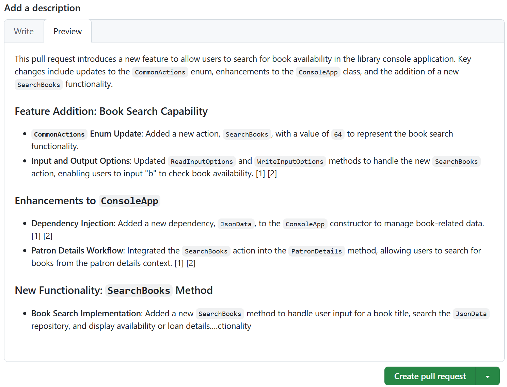

---
lab:
  title: 演習 - GitHub Copilot を使用して新しいコード機能を開発する
  description: GitHub Copilot in Visual Studio Code を使用して、新しいコード機能の開発を高速化する方法について説明します。
---

# GitHub Copilot を使用して新しいコード機能を開発する

GitHub Copilot のコード補完機能と対話型チャット機能により、開発者はより速く、より少ないエラーでコードを記述できるようになります。 記述されているコードのコンテキストに基づいて、コード スニペット、関数、さらにはクラス全体の提案を提供します。 この演習では、GitHub Copilot を使用して、Visual Studio Code での新しいコード機能の開発を加速します。

この演習の所要時間は約 **30** 分です。

> **重要**:この演習を完了するには、自分の GitHub アカウントと GitHub Copilot サブスクリプションを用意する必要があります。 GitHub アカウントをお持ちでない場合は、無料の個人用アカウントに<a href="https://github.com/" target="_blank">サインアップ</a>し、GitHub Copilot Free プランを使用して演習を完了できます。 ラボ環境内から GitHub Copilot Pro、GitHub Copilot Pro+、GitHub Copilot Business、または GitHub Copilot Enterprise サブスクリプションにアクセスできる場合は、既存の GitHub Copilot サブスクリプションを使用してこの演習を完了できます。

## 開始する前に

ラボ環境には次のものが必要です。Git 2.48 以降、.NET SDK 9.0 以降、C# 開発キット拡張機能をインストールした Visual Studio Code、GitHub Copilot が有効になっている GitHub アカウントへのアクセス。

この演習のラボ環境としてローカル PC を使用している場合:

- ローカル PC をラボ環境として構成する方法については、ブラウザーで次のリンクを開いてください: <a href="https://go.microsoft.com/fwlink/?linkid=2320147" target="_blank">ラボ環境のリソースを構成する</a>。

- Visual Studio Code で GitHub Copilot サブスクリプションを有効にする方法については、ブラウザーで次のリンクを開いてください: <a href="https://go.microsoft.com/fwlink/?linkid=2320158" target="_blank">Visual Studio Code で GitHub Copilot を有効にする</a>。

この演習に、ホストされたラボ環境をお使いの場合:

- Visual Studio Code で GitHub Copilot サブスクリプションを有効にする方法については、次の URL をブラウザーのサイト ナビゲーション バーに貼り付けてください: <a href="https://go.microsoft.com/fwlink/?linkid=2320158" target="_blank">Visual Studio Code で GitHub Copilot を有効にする</a>。

- コマンド ターミナルを開き、次のコマンドを実行します。

    Visual Studio Code が正しいバージョンの .NET を使用するように構成されていることを確認するには、次のコマンドを実行します。

    ```bash

    dotnet nuget add source https://api.nuget.org/v3/index.json -n nuget.org

    ```

    Git が自分の名前とメール アドレスを使用するように構成されていることを確認するには、次のコマンドを自分の情報で更新してから、コマンドを実行します。

    ```bash

    git config --global user.name "John Doe"

    ```

    ```bash

    git config --global user.email johndoe@example.com

    ```

## 演習のシナリオ

あなたは地域コミュニティの IT 部署で働く開発者です。 公共図書館を支えるバックエンド システムが火災で失われました。 システムが置き換えられるまで、チームは図書館スタッフが業務を管理できるようにするための一時的なソリューションを開発する必要があります。 チームは、開発プロセスをスピードアップするために GitHub Copilot を選びました。

図書館アプリケーションの初期バージョンはエンド ユーザーによってテストされており、いくつかの追加機能が依頼されています。 チームは、次の機能に取り組むことに同意しました。

- 書籍の在庫: 司書が書籍の在庫の状態を確認できるようにします。 この機能では、書籍が貸し出し可能であることを示すメッセージ、またはその書籍が現在他の利用者に貸し出し中の場合は返却期限を表示する必要があります。

- 書籍の貸出: 司書が書籍を利用者に貸し出せるようにします (書籍がある場合)。 この機能では、利用者が貸し出し中の書籍を受け取るオプションを表示し、新しい貸し出し内容で Loans.json を更新し、利用者の貸し出し詳細を更新して表示する必要があります。

- 書籍の予約: 司書が利用者のために書籍を予約できるようにします (書籍が既に予約されている場合を除く)。 この機能は、新しい書籍予約プロセスを実装する必要があります。 この機能では、予約プロセスのサポートに必要な新しいクラスとインターフェイスと共に、新しい Reservations.json ファイルを作成する必要がある場合があります。

各チーム メンバーは新しい機能のうちの 1 つに取り組み、その後再グループ化します。 あなたは、書籍の在庫の状態を判断する機能に取り組みます。 同僚は、書籍を利用者に貸し出す機能に取り組みます。 最後の、利用者のために書籍を予約する機能は、他の 2 つの機能が完了した後に開発されます。

この演習には、次のタスクが含まれています。

1. Visual Studio Code で図書館アプリケーションを設定します。

1. Visual Studio Code を使用して、ライブラリ アプリケーション用の GitHub リポジトリを作成する。

1. コード リポジトリに "書籍の在庫" ブランチを作成します。

1. 新しい "書籍の在庫" 機能を開発します。

    - GitHub Copilot の提案を使用して、コードをより迅速かつ正確に実装できるようにします。
    - コードの更新をリモート リポジトリの "書籍の在庫" ブランチと同期させます。

1. "book availability" の更新内容をリポジトリのメイン ブランチにマージします。

## Visual Studio Code で図書館アプリケーションを設定する

既存のアプリケーションをダウンロードし、コード ファイルを展開した後、Visual Studio Code でソリューションを開く必要があります。

図書館アプリケーションを設定するには、次の手順に従います。

1. ラボ環境でブラウザー ウィンドウを開きます。

1. 図書館アプリケーションを含む ZIP ファイルをダウンロードするには、次の URL をブラウザーのアドレス バーに貼り付けます。[GitHub Copilot ラボ - コード機能の開発](https://github.com/MicrosoftLearning/mslearn-github-copilot-dev/raw/refs/heads/main/DownloadableCodeProjects/Downloads/AZ2007LabAppM3.zip)

    ZIP ファイルの名前は **AZ2007LabAppM3.zip** です。

1. **AZ2007LabAppM3.zip** ファイルからファイルを展開してください。

    次に例を示します。

    1. ラボ環境のダウンロード フォルダーに移動します。

    1. **AZ2007LabAppM3.zip** を右クリックし、**[すべて展開]** を選択します。

    1. **[完了時に展開されたファイルを表示する]** を選んでから、**[展開]** を選びます。

1. 展開されたファイル フォルダーを開き、**AccelerateDevGHCopilot** フォルダーを Windows デスクトップ フォルダーなどのアクセスしやすい場所にコピーします。

1. Visual Studio Code で **AccelerateDevGHCopilot** フォルダーを開きます。

    次に例を示します。

    1. ラボ環境で Visual Studio Code を開きます。

    1. Visual Studio Code の **[ファイル]** メニューで、 **[フォルダーを開く]** を選択します。

    1. Windows デスクトップ フォルダーに移動し、**AccelerateDevGHCopilot** を選択してから、**[フォルダーの選択]** を選択します。

1. Visual Studio Code のソリューション エクスプローラー ビューで、次のソリューション構造を確認します:

    - AccelerateDevGHCopilot\
        - src\
            - Library.ApplicationCore\
            - Library.Console\
            - Library.Infrastructure\
        - tests\
            - UnitTests\

1. ソリューションが正常にビルドされていることを確認します。

    たとえば、ソリューション エクスプローラー ビューで、**AccelerateDevGHCopilot** を右クリックし、次に **[ビルド]** を選択します。

    警告はいくつか表示されますが、エラーは発生しないはずです。

## コード用の GitHub リポジトリを作成する

コード用の GitHub リポジトリを作成すると、他のユーザーと作業を共有したり、プロジェクトで共同作業を行うことができます。

> **注**:自分の GitHub アカウントを使用して、ライブラリ アプリケーション用のプライベート GitHub リポジトリを作成してください。

以下の手順に従って、演習のこのセクションを完了します。

1. ブラウザー ウィンドウを開き、GitHub アカウントに移動します。

    GitHub ログイン ページは [https://github.com/login](https://github.com/login) です。

1. GitHub アカウントにサインインします。

1. GitHub アカウント メニューを開き、**[ご使用のリポジトリ]** を選択します。

1. [Visual Studio Code] ウィンドウに切り替えます。

1. Visual Studio Code で、ソース管理ビューを開きます。

1. **[GitHub に公開]** を選択します。

1. リポジトリの名前は **AccelerateDevGHCopilot** です。

    > **注**:Visual Studio Code で GitHub にサインインしていない場合は、サインインするように求められます。 サインインしたら、要求されたアクセス許可で Visual Studio Code を認可します。

1. **[GitHub プライベート リポジトリに公開]** を選択します。

1. 公開プロセス中に、Visual Studio Code にステータス メッセージが表示されている点に注目します。

    公開プロセスが完了すると、指定した GitHub リポジトリにコードが正常に公開されたことを示すメッセージが表示されます。

1. GitHub アカウントのブラウザー ウィンドウに切り替えます。

1. GitHub アカウントで新しい AccelerateDevGHCopilot リポジトリを開きます。

    AccelerateDevGHCopilot リポジトリが表示されない場合は、ページを更新します。 それでもリポジトリが表示されない場合は、次の手順を試してください。

    1. Visual Studio Code に切り替えます。
    1. 通知を開きます (通知は、新しいリポジトリが公開されたときに生成されています)。
    1. **[GitHub 上で開く]** を選択してリポジトリを開きます。

## リポジトリに新しいブランチを作成する

新しい "書籍の在庫" 機能の開発を開始する前に、リポジトリに新しいブランチを作成する必要があります。 これにより、リポジトリのメイン ブランチに影響を与えずに、新しい機能に取り組むことができます。 コードの準備ができたら、新しい機能をメイン ブランチにマージできます。

以下の手順に従って、演習のこのセクションを完了します。

1. Visual Studio Code で AccelerateDevGHCopilot ソリューションが開いていることを確認します。

1. [ソース管理] ビューを選択し、ローカル リポジトリがリモート リポジトリ (プルまたは同期) と同期していることを確認します。

1. ウィンドウの左下隅にある  **[main]**  を選択します。

1. 新しいブランチを作成するには、「**書籍の在庫**」と入力して **[+ 新しいブランチの作成]** を選びます。

1. 新しいブランチをリモート リポジトリにプッシュするには、**[ブランチの発行]** を選択します。

## 新しい "書籍の在庫状況" 機能を開発する

演習のこのセクションでは、GitHub Copilot を使用して、図書館アプリケーションの新しい機能を開発します。 依頼された機能により、図書館員は書籍が貸し出し可能かどうかを確認できるようになります。これは、現在の図書館アプリケーションではサポートされていない一般的なシナリオです。

書籍の在庫状況機能を実装するには、次の更新を完了する必要があります。

- CommonActions.cs の **CommonActions** 列挙に新しい **SearchBooks** アクションを追加します。

- ConsoleApp.cs の **WriteInputOptions** メソッドを更新します。

    - 新しい **CommonActions.SearchBooks** オプションのサポートを追加します。
    - 書籍が貸出可能かどうかを確認するオプションを表示します。

- ConsoleApp.cs の **ReadInputOptions** メソッドを更新します。

    - 新しい **CommonActions.SearchBooks** オプションのサポートを追加します。

- ConsoleApp.cs の **PatronDetails** メソッドを更新します。

    - **ReadInputOptions** を呼び出す前に、**CommonActions.SearchBooks** を **options** に追加します。
    - **SearchBooks** アクションを処理するために **else if** を追加します。
    - **else if** ブロックは、**SearchBooks** という新しいメソッドを呼び出す必要があります。

- ConsoleApp.cs に新しい **SearchBooks** メソッドを作成します。

    - **SearchBooks** メソッドは、ユーザーが指定した書籍のタイトルを読み取る必要があります。
    - 書籍が貸し出し可能かどうかを確認し、次のいずれかを示すメッセージを表示します。

        - "**book.title** は貸し出し可能です"、または
        - "**book.title** は別の利用者に貸し出し中です。 返却期限は **loan.DueDate** です。"

GitHub Copilot Chat は、新機能の完成に必要なコード更新の実装を支援します。

- インライン チャット セッションを使用すると、要件に基づいて、より小さく、より用心深いコードの更新を実装できます。
- より対話的で反復的なアプローチが必要な大規模なコードの更新には、チャット ビューを使用できます。

### インライン チャットを使用して "book availability" の更新を実装する

インライン チャット セッションを使用すると、コード エディター内で GitHub Copilot と直接対話できます。 インライン チャットを使用すると、質問したり、コードの提案を依頼したり、GitHub Copilot によって生成されたコードの説明を受け取ったりできます。

以下の手順に従って、演習のこのセクションを完了します。

1. [ソリューション エクスプローラー] ビューを開きます。

1. **Library.Console** プロジェクトを展開します。

1. CommonActions.cs ファイルを開いて、**CommonActions** 列挙型を選択します。

    新しい **SearchBooks** アクションを **CommonActions** に追加する必要があります。

1. インライン チャットを開き、次のプロンプトを入力します。

    ```plaintext
    Update selection to include a new `SearchBooks` action.
    ```

    GitHub Copilot により、新しい **SearchBooks** アクションを **CommonActions** 列挙型に追加するコードの更新が提案されるはずです。

1. 推奨された更新を確認し、**[承諾]** を選択します。

    更新されたコードは、次のコード スニペットのようになります。

    ```csharp

    public enum CommonActions
    {
        Repeat = 0,
        Select = 1,
        Quit = 2,
        SearchPatrons = 4,
        RenewPatronMembership = 8,
        ReturnLoanedBook = 16,
        ExtendLoanedBook = 32,
        SearchBooks = 64
    }

    ```

1. ConsoleApp.cs ファイルを開きます。

1. **WriteInputOptions** メソッドを見つけて選択します。

    新しい **CommonActions.SearchBooks** オプションのサポートを追加する必要があります。 **SearchBooks** オプションにフラグが設定されている場合は、書籍が貸し出し可能かどうかを確認するオプションを表示します。

1. インライン チャットを開き、次のプロンプトを入力します。

    ```plaintext
    Update selection to include an option for the `CommonActions.SearchBooks` action. Use the letter "b" and the message "to check for book availability".
    ```

    GitHub Copilot により、**SearchBooks** アクションに新しい **if** ブロックを追加するコードの更新が提案されます。

1. 推奨された更新を確認し、**[承諾]** を選択します。

    提案される更新は、次のコード スニペットのような内容になります。

    ```csharp

    static void WriteInputOptions(CommonActions options)
    {
        Console.WriteLine("Input Options:");
        if (options.HasFlag(CommonActions.ReturnLoanedBook))
        {
            Console.WriteLine(" - \"r\" to mark as returned");
        }
        if (options.HasFlag(CommonActions.ExtendLoanedBook))
        {
            Console.WriteLine(" - \"e\" to extend the book loan");
        }
        if (options.HasFlag(CommonActions.RenewPatronMembership))
        {
            Console.WriteLine(" - \"m\" to extend patron's membership");
        }
        if (options.HasFlag(CommonActions.SearchPatrons))
        {
            Console.WriteLine(" - \"s\" for new search");
        }
        if (options.HasFlag(CommonActions.SearchBooks))
        {
            Console.WriteLine(" - \"b\" to check for book availability");
        }
        if (options.HasFlag(CommonActions.Quit))
        {
            Console.WriteLine(" - \"q\" to quit");
        }
        if (options.HasFlag(CommonActions.Select))
        {
            Console.WriteLine("Or type a number to select a list item.");
        }
    }

    ```

1. 少し上にスクロールして、**ReadInputOptions** メソッドを見つけて選択します。

    もう一度、新しい **CommonActions.SearchBooks** オプションのサポートを追加する必要があります。 ユーザーが **SearchBooks** アクションを選択した場合を処理するケースを含めます。

1. インライン チャットを開き、次のプロンプトを入力します。

    ```plaintext
    Update selection to include an option for the `CommonActions.SearchBooks` action.
    ```

    GitHub Copilot により、ユーザーが **SearchBooks** アクションを選択した場合にそれを処理する新しい**ケース**を追加する更新が提案されます。

1. 推奨された更新を確認し、**[承諾]** を選択します。

    提案される更新は、次のコード スニペットのような内容になります。

    ```csharp

    static CommonActions ReadInputOptions(CommonActions options, out int optionNumber)
    {
        CommonActions action;
        optionNumber = 0;
        do
        {
            Console.WriteLine();
            WriteInputOptions(options);
            string? userInput = Console.ReadLine();

            action = userInput switch
            {
                "q" when options.HasFlag(CommonActions.Quit) => CommonActions.Quit,
                "s" when options.HasFlag(CommonActions.SearchPatrons) => CommonActions.SearchPatrons,
                "m" when options.HasFlag(CommonActions.RenewPatronMembership) => CommonActions.RenewPatronMembership,
                "e" when options.HasFlag(CommonActions.ExtendLoanedBook) => CommonActions.ExtendLoanedBook,
                "r" when options.HasFlag(CommonActions.ReturnLoanedBook) => CommonActions.ReturnLoanedBook,
                "b" when options.HasFlag(CommonActions.SearchBooks) => CommonActions.SearchBooks,
                _ when int.TryParse(userInput, out optionNumber) => CommonActions.Select,
                _ => CommonActions.Repeat
            };

            if (action == CommonActions.Repeat)
            {
                Console.WriteLine("Invalid input. Please try again.");
            }
        } while (action == CommonActions.Repeat);
        return action;
    }

    ```

1. 下にスクロールし、**PatronDetails** メソッドを見つけて選択します。

    2 つのことを実行する必要があります。

    - **ReadInputOptions** を呼び出す前に、**CommonActions.SearchBooks** を **options** に追加する必要があります。
    - また、**SearchBooks** アクションを処理するために **else if** を追加する必要があります。 **else if** ブロックは、**SearchBooks** という新しいメソッドを呼び出す必要があります。

    同じプロンプトで両方の要件に対応できます。

1. インライン チャットを開き、次のプロンプトを入力します。

    ```plaintext
    Update selection to add `CommonActions.SearchBooks` to `options` before calling `ReadInputOptions`. Add an `else if` block to handle the `SearchBooks` action. The `else if` block should call a new method named `SearchBooks`.
    ```

    GitHub Copilot により、**ReadInputOptions** を呼び出す前に、**CommonActions.SearchBooks** を **options** に追加するコードの更新が提案されるはずです。

1. 推奨された更新を確認し、**[承諾]** を選択します。

    ```csharp

    async Task<ConsoleState> PatronDetails()
    {
        Console.WriteLine($"Name: {selectedPatronDetails.Name}");
        Console.WriteLine($"Membership Expiration: {selectedPatronDetails.MembershipEnd}");
        Console.WriteLine();
        Console.WriteLine("Book Loans:");
        int loanNumber = 1;
        foreach (Loan loan in selectedPatronDetails.Loans)
        {
            Console.WriteLine($"{loanNumber}) {loan.BookItem!.Book!.Title} - Due: {loan.DueDate} - Returned: {(loan.ReturnDate != null).ToString()}");
            loanNumber++;
        }

        CommonActions options = CommonActions.SearchPatrons | CommonActions.Quit | CommonActions.Select | CommonActions.RenewPatronMembership | CommonActions.SearchBooks;
        CommonActions action = ReadInputOptions(options, out int selectedLoanNumber);
        if (action == CommonActions.Select)
        {
            if (selectedLoanNumber >= 1 && selectedLoanNumber <= selectedPatronDetails.Loans.Count())
            {
                var selectedLoan = selectedPatronDetails.Loans.ElementAt(selectedLoanNumber - 1);
                selectedLoanDetails = selectedPatronDetails.Loans.Where(l => l.Id == selectedLoan.Id).Single();
                return ConsoleState.LoanDetails;
            }
            else
            {
                Console.WriteLine("Invalid book loan number. Please try again.");
                return ConsoleState.PatronDetails;
            }
        }
        else if (action == CommonActions.Quit)
        {
            return ConsoleState.Quit;
        }
        else if (action == CommonActions.SearchPatrons)
        {
            return ConsoleState.PatronSearch;
        }
        else if (action == CommonActions.RenewPatronMembership)
        {
            var status = await _patronService.RenewMembership(selectedPatronDetails.Id);
            Console.WriteLine(EnumHelper.GetDescription(status));
            // reloading after renewing membership
            selectedPatronDetails = (await _patronRepository.GetPatron(selectedPatronDetails.Id))!;
            return ConsoleState.PatronDetails;
        }
        else if (action == CommonActions.SearchBooks)
        {
            return await SearchBooks();
        }

        throw new InvalidOperationException("An input option is not handled.");
    }

    ```

    > **注**:インライン チャットによって提案されたコードには、**SearchBooks** メソッドのスタブ コードが含まれている場合があります。 そのコードを受け入れることもできます。 次のセクションでは、**SearchBooks** メソッドを実装します。

### チャット ビューを使用して SearchBooks メソッドを実装する

"書籍の在庫状況" の更新の実装には、**SearchBooks** メソッドを作成するという手順が残っています。 **SearchBooks** メソッドは、ユーザーが指定した書籍タイトルを読み取り、書籍が貸し出し可能かどうかを確認し、書籍の貸し出し状態を示すメッセージを表示します。 チャット ビューを使用して要件を評価し、**SearchBooks** メソッドを実装します。

GitHub Copilot のチャット ビューには、インライン チャットでは使用できない、会話型で対話型の環境が用意されています。 チャット ビューを使用すると、GitHub Copilot によって生成されたコードについて質問したり、コードの提案を依頼したり、説明を受けたりすることができます。 チャット ビューでは、次の 3 つのモードがサポートされています。

- 質問モード:質問モードは、コードベースをより深く理解し、アイデアをブレインストーミングし、コーディング タスクを支援するために使用されます。 質問モードで生成されたコード提案は、コードベースに直接実装することも、クリップボードにコピーすることもできます。
- 編集モード:編集モードは、リファクタリングや新しい機能の追加など、コードを変更するために使用されます。 編集モードでは、プロジェクト内の複数のファイルにわたって編集を行うことができます。
- エージェント モード:エージェント モードは、上位レベルのタスクを定義し、そのタスクを実行するためのエージェント コード編集セッションを開始するために使用されます。 エージェント モードでは、Copilot は必要な作業を自律的に計画し、関連するファイルとコンテキストを決定します。 エージェントにより、コードの変更、テストの実行、さらにはアプリケーションのデプロイまで行うことができます。

**SearchBooks** メソッドの実装には、質問および編集モードを使用します。

以下の手順に従って、演習のこのセクションを完了します。

1. **SearchBooks** メソッドのプロセス要件について少し考えてみましょう。

    メソッドが完了する必要があるプロセスは何でしょうか? このメソッドの戻り値の型は何でしょうか? パラメーターは必要ですか?

    **SearchBooks** メソッドは、次のプロセスを実装する必要があります。

    1. ユーザーに書籍のタイトルの入力を求めるメッセージを表示する。
    1. ユーザーが指定した書籍のタイトルを読み取る。
    1. 書籍が貸し出し可能かどうかを確認します。
    1. 次のいずれかのオプションを示すメッセージを表示する。

        - "**{book.title}** は貸し出し可能です"
        - "**{book.title}** は別の利用者に貸し出されています。 返却期限は **{loan.DueDate}** です。"

    メッセージ オプションをビルドするには、コードで次の JSON ファイルにアクセスする必要があります。

    - 一致する **Title** と **BookId** を見つけるには、**Books.json** が必要です。
    - 一致する **BookItemId** の **ReturnDate** と **DueDate** を検索するには、**Loans.json** が必要です。 **BookItemId** は、**Books.json** の **BookId** と同じです。

1. ConsoleApp.cs ファイルに次の **SearchBooks** メソッドが作成されていることを確認してください。

    ```csharp

    async Task<ConsoleState> SearchBooks()
    {

        return ConsoleState.PatronDetails;
    }

    ```

    > **注**:GitHub Copilot によって作成されたコード コメントは必ず削除してください。 不要で不正確なコメントは、GitHub Copilot の提案に悪影響を及ぼすおそれがあります。

1. **SearchBooks** メソッドを選択します。

1. チャット ビューを開き、次のプロンプトを入力します。

    ```plaintext
    Update selection to obtain a book title. Prompt the user to "Enter a book title to search for". Read the user input and ensure the book title isn't null.
    ```

1. 提案された更新内容を確認します。

    提案される更新は、次のコード スニペットのような内容になります。

    ```csharp

    async Task<ConsoleState> SearchBooks()
    {
        string? bookTitle = null;
        while (string.IsNullOrWhiteSpace(bookTitle))
        {
            Console.Write("Enter a book title to search for: ");
            bookTitle = Console.ReadLine();
        }
    
        // Placeholder for further logic to search for the book
        Console.WriteLine($"Searching for the book titled \"{bookTitle}\"...");
    
        return ConsoleState.PatronDetails;
    }

    ```

1. 提案されたコードの上にマウス ポインターを合わせ、**[src\\Library.Console\\ConsoleApp.cs に適用]** を選択します。

    提案されたコードはコード エディターに表示され、**[保持する]** または **[元に戻す]** オプションが表示されます。

1. コード エディターで、提案されたコードを受け入れるには、**[保持する]** を選択します。

1. **SearchBooks** メソッドを選択します。

1. ドラッグ アンド ドロップ操作を使用して、次のファイルをチャット コンテキストに追加します。

    (Library.Console プロジェクトから)
    - ConsoleApp.cs
    - Program.cs
    - Books.json
    - Loans.json
    - BookItems.json

    (Library.Infrastructure プロジェクトから)
    - JsonData.cs
    - JsonLoanRepository.cs

1. 次のプロンプトを入力します。

    ```plaintext
    @workspace  Explain how to update the `SearchBooks` method and ConsoleApps class to find a matching book title in the `Books.json` file. Use the user supplied book title to find a matching book. If a book is found, use Loans.json to check if the book is available for loan. If the book has been returned, display a message stating "`book.title` is available for loan". If the book is on loan, display a message stating "`book.title` is on loan to another patron. The return due date is `loan.DueDate`".
    ```

1. 少し時間をかけて、提案された更新を確認しましょう。

    次のことに注意してください。

    - 応答には、提案された更新内容の詳細な説明が含まれています。
    - ConsoleApp クラスでは、Books.json および Loans.json にアクセスするために JsonData オブジェクトが必要です。 提案されたコードでは、依存関係の挿入を使用して、JsonData オブジェクトを ConsoleApp クラスのコンストラクターに渡します。
    - SearchBooks メソッドは、書籍タイトルが利用可能かどうかを判断し、適切なメッセージを表示するロジックで更新する必要があります。 提案されたコードでは、LINQ クエリを使用して貸し出しの状態を確認します。
    - JsonData オブジェクトを ConsoleApp クラスに渡すには、Program.cs ファイルを更新する必要があります。

    応答には次の情報を含める必要があります。

    ```plaintext

    1. Dependency Injection:
    
        Added JsonData as a dependency to the ConsoleApp constructor to access the JSON data files.

    2. Book Search:
    
        Used FirstOrDefault to find a book in Books.json that matches the user-supplied title (case-insensitive).

    3. Book Item Lookup:
    
        Retrieved the corresponding BookItem using the BookId from BookItems.json.

    4. Loan Check:
    
        Checked Loans.json for an active loan (i.e., a loan with a null ReturnDate) for the BookItem.

    5. Output Messages:
    
        Displayed whether the book is available for loan or currently on loan with the due date.

    Integration in Program.cs

        Ensure that JsonData is registered in the dependency injection container in Program.cs:

    ```

    チャット ビューの**質問**モードを使用してコードの更新を分析し、**編集**モードを使用してコードの更新を実装できます。

1. GitHub Copilot の応答を使用して新しいプロンプトを作成します。

    たとえば、説明セクションを使用して次のプロンプトを作成できます。

    ```plaintext

    Add JsonData as a dependency to the ConsoleApp constructor to access the JSON data files. Use FirstOrDefault to find a book in Books.json that matches the user-supplied title (case-insensitive). Retrieve the corresponding BookItem using the BookId from BookItems.json. Check Loans.json for an active loan (loan.ReturnDate == null) for the BookItem. Display whether the book is available for loan or currently on loan with the due date. Ensure that JsonData is registered in the dependency injection container in Program.cs.

    ```

    特定の要件を満たすようにプロンプトを調整できます。 たとえば、エンド ユーザーに特定のメッセージを表示する場合は、プロンプトに要件を追加できます。

    ```plaintext

    Add JsonData as a dependency to the ConsoleApp constructor to access the JSON data files. Use FirstOrDefault to find a book in Books.json that matches the user-supplied title (case-insensitive). Retrieve the corresponding BookItem using the BookId from BookItems.json. Check Loans.json for an active loan (loan.ReturnDate == null) for the BookItem. Display whether the book is available for loan or currently on loan with the due date. Ensure that JsonData is registered in the dependency injection container in Program.cs. If the book has been returned, display a message stating "`book.title` is available for loan". If the book is on loan, display a message stating "`book.title` is on loan to another patron. The return due date is `loan.DueDate`".

    ```

1. チャット ビューを編集モードに切り替えるには、**[モードの設定]** を選択し、**[編集]** を選択します。

    新しいセッションを開始するように求められたら、**[はい]** を選択します。

1. ドラッグ アンド ドロップ操作を使用して、次のファイルをチャット コンテキストに追加します。

    (Library.Console プロジェクトから)
    - ConsoleApp.cs
    - Program.cs
    - Books.json
    - Loans.json
    - BookItems.json

    (Library.Infrastructure プロジェクトから)
    - JsonData.cs
    - JsonLoanRepository.cs

1. **SearchBooks** メソッドを選択します。

1. 次のプロンプトを入力します。

    ```plaintext

    Add JsonData as a dependency to the ConsoleApp constructor to access the JSON data files. Use FirstOrDefault to find a book in Books.json that matches the user-supplied title (case-insensitive). Retrieve the corresponding BookItem using the BookId from BookItems.json. Check Loans.json for an active loan (loan.ReturnDate == null) for the BookItem. Display whether the book is available for loan or currently on loan with the due date. Ensure that JsonData is registered in the dependency injection container in Program.cs. If the book has been returned, display a message stating "`book.title` is available for loan". If the book is on loan, display a message stating "`book.title` is on loan to another patron. The return due date is `loan.DueDate`".

    ```

1. 少し時間を取って、ConsoleApp.cs ファイルで提案された更新内容を確認しましょう。

    提案されたコードの更新内容を移動するには、**[前へ]** と **[次へ]** を使用するか、ファイルを手動でスクロールすることができます。

    **ConsoleApp.cs**

    **JsonData** 依存関係を **ConsoleApp** コンストラクターに追加するコードの更新は、ConsoleApp クラスの上部近くにあります。

    ```csharp

    JsonData _jsonData;

    public ConsoleApp(ILoanService loanService, IPatronService patronService, IPatronRepository patronRepository, ILoanRepository loanRepository, JsonData jsonData)
    {
        _patronRepository = patronRepository;
        _loanRepository = loanRepository;
        _loanService = loanService;
        _patronService = patronService;
        _jsonData = jsonData;
    }

    ```

    本が貸し出し可能かどうかを確認するコードの更新は、**SearchBooks** メソッド内にあります。

    ```csharp

    async Task<ConsoleState> SearchBooks()
    {
        string? bookTitle = null;
        while (string.IsNullOrWhiteSpace(bookTitle))
        {
            Console.Write("Enter a book title to search for: ");
            bookTitle = Console.ReadLine();
        }

        await _jsonData.EnsureDataLoaded();

        var book = _jsonData.Books!.FirstOrDefault(b => string.Equals(b.Title, bookTitle, StringComparison.OrdinalIgnoreCase));
        if (book == null)
        {
            Console.WriteLine($"No book found with the title \"{bookTitle}\".");
            return ConsoleState.PatronDetails;
        }

        var bookItem = _jsonData.BookItems!.FirstOrDefault(bi => bi.BookId == book.Id);
        if (bookItem == null)
        {
            Console.WriteLine($"No book item found for the title \"{book.Title}\".");
            return ConsoleState.PatronDetails;
        }

        var loan = _jsonData.Loans!.FirstOrDefault(l => l.BookItemId == bookItem.Id && l.ReturnDate == null);
        if (loan == null)
        {
            Console.WriteLine($"\"{book.Title}\" is available for loan.");
        }
        else
        {
            Console.WriteLine($"\"{book.Title}\" is on loan to another patron. The return due date is {loan.DueDate}.");
        }

        return ConsoleState.PatronDetails;
    }

    ```

    **Program.cs**

    依存関係の挿入のために JsonData と ConsoleApp を登録するコードは、Program.cs ファイルに既に存在していました。

    ```csharp

    services.AddSingleton<JsonData>();
    services.AddSingleton<ConsoleApp>();

    ```

1. チャット ビューですべての編集内容を保持するには、**[保持する]** を選択します。

    更新を受け入れる前に、必ず GitHub Copilot の提案内容を確認します。

    提案された更新内容について不明な点がある場合は、変更を受け入れてから GitHub Copilot に説明を求めることができます。 更新を行わないことに決めた場合は、編集内容を元に戻すことができます。

    > **注**:GitHub Copilot がカルチャ固有の形式を使用して返却日を書式設定することを提案した場合、ConsoleApp.cs ファイルの先頭に `using System.Globalization;` ステートメントが追加されていることを確認します。

1. ConsoleApp.cs ファイルと Program.cs ファイルの両方で更新を受け入れたことを確認します。

1. ConsoleApp.cs ファイルの先頭までスクロールし、次のコード行を見つけます。

    ```csharp

    JsonData _jsonData;

    ```

1. ConsoleApp クラスで JsonData が認識されない場合は、ConsoleApp クラスの上に次の using ステートメントを追加します。

    ```csharp
    
    using Library.Infrastructure.Data;
    
    ```

1. Visual Studio Code のソリューション エクスプローラー ビューを開きます。

1. ソリューションをビルドし、コードの更新によってエラーが発生していないことを確認します。

    警告メッセージが表示されますが、エラーは発生しません。

    ソリューション エクスプローラー ビューを使用してソリューションをビルドするには、**AccelerateDevGHCopilot** を右クリックし、**[ビルド]** を選択します。

## "book availability" の更新内容をリポジトリのメイン ブランチにマージする

コードをリポジトリのメイン ブランチにマージする前にテストすることが重要です。 テストにより、コードが期待どおりに機能し、新しい問題が発生しないことが確認できます。 この演習では、手動テストを使用して、"書籍の在庫状況" 機能が期待どおりに機能することを確認します。

演習のこのセクションでは、次のタスクを完了します。

1. "書籍の在庫状況" 機能をテストします。
1. 変更をリモート リポジトリと同期します。
1. 変更をリポジトリのメイン ブランチにマージする pull request を作成します。

### "書籍の在庫状況" 機能をテストする

手動テストを使用して、新しい機能が期待どおりに機能するかどうかを確認できます。 検証できるデータ ソースを使用することが重要です。 この場合、**Books.json** ファイルと **Loans.json** ファイルを使用して、新しい機能が書籍の在庫状態を正しく報告していることを確認します。

以下の手順に従って、演習のこのセクションを完了します。

1. アプリケーションを実行するには、**Library.Console** を右クリックし、**[デバッグ]** を選択してから **[新しいインスタンスを開始]** を選択します。

1. 利用者名の入力を求められたら、「**One**」と入力して Enter キーを押します。

    検索クエリに一致する利用者の一覧が表示されます。

1. "Input Options" プロンプトで「**2**」と入力し、Enter キーを押します。

    「**2**」と入力すると、リストにある 2 番目の利用者が選択されます。

    利用者の名前とメンバーシップの状態が表示され、その後に書籍貸出の詳細が表示されます。

1. "Input Options" プロンプトで「**b**」と入力し、Enter キーを押します。

    「**b**」と入力すると、書籍の在庫状態を検索するオプションが選択されます。

    書籍のタイトルを入力するプロンプトが表示されます。

1. 「**Book One**」と入力し Enter キーを押します。

    ダウンロードした元のデータでは、**Book One** は現在 **Patron Forty-Nine**に貸出中であるため、在庫がありません。

1. 書籍が別の利用者に貸し出されていることを示すメッセージがアプリケーションに表示されることを確認します。

1. "Input Options" プロンプトで「**b**」と入力し、Enter キーを押します。

1. 「**Book Nineteen**」と入力して Enter キーを押します。

1. 書籍が貸出可能であることを示すメッセージがアプリケーションに表示されることを確認します。

1. "Input Options" プロンプトで「**q**」と入力し、Enter キーを押します。

1. デバッグ セッションを停止します。

1. エクスプローラー ビューを使用して、**Loans.json** ファイルを見つけて開きます。

    Loans.json ファイルは、各書籍の貸出状況を追跡するために使用されます。 Loans.json ファイルを使用して、Book One と Book Nineteen の在庫状態が正しいことを確認できます。

    更新された Loans.json ファイルは、**Library.Console\bin\Debug\net8.0\Json** フォルダーまたは **Library.Console\Json** フォルダーのいずれかに配置されます。

    - Visual Studio Code デバッガーを使用してアプリを実行している場合、更新された Loans.json ファイルは **Library.Console\bin\Debug\net8.0\Json** フォルダーにあるはずです。

    - **AccelerateDevGHCopilot\src\Library.Console** フォルダーから **dotnet run** コマンドを使用してアプリを実行している場合、更新された Loans.json ファイルは **Library.Console\Json** フォルダーにあるはずです。

1. 貸出 ID 37 と貸出 ID 46 が両方とも Book One (**"BookItemId":1**) のものであることを確認します。

    貸出 ID は Loans.json ファイルに順番に一覧表示されます。

    - 貸出 ID 37 の **ReturnDate** 値は **2024-01-17** であり、その日に書籍が返却されたことを示します。
    - 貸出 ID 46 の **ReturnDate** 値は **null** である必要があります。これは、書籍が現在貸し出し中であることを示します (**2024-07-09** に貸し出されましたが、返却されていません)。

    **ReturnDate** 値は、書籍が現在貸し出し中かどうかを判断するために使用されます。 **ReturnDate** の値が **null** の場合、その本は現在貸し出し中であることを示します。

1. 貸出 ID 34 が Book Nineteen (**"BookItemId":19**) であることと、**ReturnDate** に値が割り当てられていることを確認します。

### 変更をリモート リポジトリと同期する

1. [ソース管理] ビューを選択します。

1. 更新したファイルが **[変更]** の一覧に表示されていることを確認します。

    CommonActions.cs ファイルと ConsoleApp.cs ファイルが **Changes** の下に一覧表示されているはずです。 Program.cs ファイルも一覧表示される場合があります。

1. GitHub Copilot を使用して、**[コミット]** のメッセージを生成します。

    ![[Copilot を使用してコミット メッセージを生成する] ボタンを示すスクリーンショット。](./Media/m03-github-copilot-commit-message.png)

1. 変更をステージングしてコミットするには、**[コミット]** を選択してから、**[はい]** を選択します。

1. リモート リポジトリへの変更を同期するには、**[変更の同期]** を選択します。

### 変更をメイン ブランチにマージする pull request を作成する

図書館員が書籍の在庫状態を判断できるようにする機能を実装しました。 ここで、変更をリポジトリのメイン ブランチにマージする必要があります。 変更をメイン ブランチにマージする pull request を作成できます。

以下の手順に従って、演習のこのセクションを完了します。

1. Web ブラウザーで GitHub リポジトリを開きます。

    Visual Studio Code から GitHub リポジトリを開くには:

    1. Visual Studio Code ウィンドウの左下隅で、**book-availability** を選択します。
    1. コンテキスト メニューで、**book-availability** ブランチの右側にある **[GitHub で開く]** アイコンを選択します。

1. GitHub リポジトリ ページで、**[比較と pull request]** タブを選択します。

1. **[ベース]** で **main** が指定されていること、**[比較]** で **book-availability** が指定されていること、**[マージ可能]** がオンになっていることを確認します。

1. **[説明を追加]** の下で、[Copilot アクション] ボタン (GitHub Copilot アイコン) を選択し、[概要の生成] オプションを選択します。

    > **注**:現時点では、GitHub Copilot Free プランでは pull request の概要機能はサポートされていません。

    GitHub Copilot Free プランを使用している場合は、独自の概要を記述することも、以下の概要を使用して pull request を完了させることもできます。

    ```plaintext

    This pull request introduces a new feature to the library console application: the ability to search for books and check their availability. It also includes updates to dependency injection and the CommonActions enumeration to support this functionality. Below are the most important changes grouped by theme.

    New Feature: Book Search

    Added a new SearchBooks action to the CommonActions enumeration (src/Library.Console/CommonActions.cs).

    Updated PatronDetails method to handle the SearchBooks action, including a new SearchBooks method that allows users to search for a book by title and check its availability (src/Library.Console/ConsoleApp.cs).

    Modified ReadInputOptions and WriteInputOptions methods to include the new SearchBooks option (src/Library.Console/ConsoleApp.cs).

    Dependency Injection Updates

    Added JsonData as a dependency in the ConsoleApp constructor and ensured it is registered in the DI container before ConsoleApp (src/Library.Console/ConsoleApp.cs, src/Library.Console/Program.cs).

    ```

1. 概要が生成されたら、**[プレビュー]** を選択します。

1. 少し時間を取って、概要を確認しましょう。

    GitHub Copilot によって生成される pull request の概要は、次の例のようになります。

    

1. **[Pull request の作成]** を選びます。

1. すべてのチェックに合格し、ベース ブランチとの競合がない場合は、**[pull request のマージ]** を選択し、**[マージの確認]** を選択します。

    変更をマージした後、**book-availability** ブランチを削除できることに注目してください。 ブランチを削除するには、**[ブランチの削除]** を選択します。

1. [Visual Studio Code] ウィンドウに切り替えます。

1. リポジトリの **main** ブランチに切り替えます。

1. ソース管理ビューを開き、リモート リポジトリから変更を**プル**します。

1. 書籍の在庫状況機能が **main** ブランチで使用できるかどうかを確認します。

## まとめ

この演習では、GitHub Copilot を使用して C# アプリケーションの新しいコード機能を開発する方法を学びました。 GitHub Copilot のインライン チャットとチャット ビューを使用して新しいブランチで機能を開発し、コードをテストして、変更をリポジトリのメイン ブランチにマージしました。 また、GitHub Copilot を使用して、コミット メッセージと pull request の概要も生成しました。

## クリーンアップ

演習が完了したので、少し時間を取って、GitHub アカウントまたは GitHub Copilot サブスクリプションに保持したくない変更が加えられていないか確認します。 変更を加えた場合は、ここで元に戻します。
