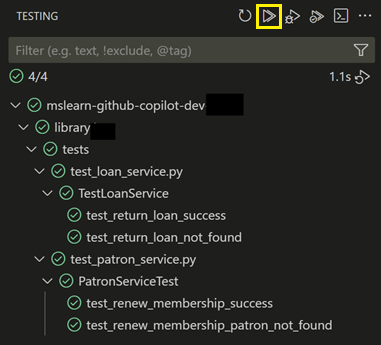

---
lab:
  title: 演習 - GitHub Copilot を使用して単体テストを開発する (Python)
  description: Visual Studio Code で GitHub を使用して単体テストの開発を高速化する方法について説明します。
---

# GitHub Copilot を使用して単体テストを開発する

GitHub Copilot を支える大規模言語モデルは、さまざまなコード テスト フレームワークとシナリオでトレーニングされています。 GitHub Copilot は、テスト ケース、テスト メソッド、テスト アサーションとモック、テスト データを生成するための優れたツールです。 この演習では、GitHub Copilot を使用して、Python アプリケーションの単体テストの開発を加速します。

この演習の完了に要する時間は約 **25** 分です。

> **重要**:この演習を完了するには、自分の GitHub アカウントと GitHub Copilot サブスクリプションを用意する必要があります。 GitHub アカウントをお持ちでない場合は、無料の個人用アカウントに<a href="https://go.microsoft.com/fwlink/?linkid=2320148" target="_blank">サインアップ</a>し、GitHub Copilot Free プランを使用して演習を完了できます。 ラボ環境内から GitHub Copilot Pro、GitHub Copilot Pro+、GitHub Copilot Business、または GitHub Copilot Enterprise サブスクリプションにアクセスできる場合は、既存の GitHub Copilot サブスクリプションを使用してこの演習を完了できます。

## 開始する前に

ラボ環境には次のものが必要です。Git 2.48 以降、Python 3.10 以降、Microsoft の Python 拡張機能をインストールした Visual Studio Code、GitHub Copilot が有効になっている GitHub アカウントへのアクセス。

この演習のラボ環境としてローカル PC を使用している場合:

- ローカル PC をラボ環境として構成する方法については、ブラウザーで次のリンクを開いてください: <a href="https://microsoftlearning.github.io/mslearn-github-copilot-dev/Instructions/Labs/LAB_AK_00_configure_lab_environment_py.html" target="_blank">ラボ環境のリソースを構成する</a>。

- Visual Studio Code で GitHub Copilot サブスクリプションを有効にする方法については、ブラウザーで次のリンクを開いてください: <a href="https://go.microsoft.com/fwlink/?linkid=2320158" target="_blank">Visual Studio Code で GitHub Copilot を有効にする</a>。

この演習に、ホストされたラボ環境をお使いの場合:

- Visual Studio Code で GitHub Copilot サブスクリプションを有効にする方法については、次の URL をブラウザーのサイト ナビゲーション バーに貼り付けてください: <a href="https://go.microsoft.com/fwlink/?linkid=2320158" target="_blank">Visual Studio Code で GitHub Copilot を有効にする</a>。

- コマンド ターミナルを開き、次のコマンドを実行します。

    Visual Studio Code が正しいバージョンの Python を使用するように構成されていることを確認するには、Python インストールがバージョン 3.10 以降であることを確認します。

    ```bash
    python --version
    ```

    Git が自分の名前とメール アドレスを使用するように構成されていることを確認するには、次のコマンドを自分の情報で更新してから、コマンドを実行します。

    ```bash

    git config --global user.name "John Doe"

    ```

    ```bash

    git config --global user.email johndoe@example.com

    ```

## 演習のシナリオ

あなたは地域コミュニティの IT 部署で働く開発者です。 公共図書館を支えるバックエンド システムが火災で失われました。 システムを置き換えられるまで、チームは図書館スタッフが業務を管理できるようにするための一時的なプロジェクトを開発する必要があります。 チームは、開発プロセスをスピードアップするために GitHub Copilot を選びました。

UnitTests という単体テスト プロジェクトを含む図書館アプリケーションの初期バージョンがあります。 GitHub Copilot を使用して、追加の単体テストの開発を高速化する必要があります。

この演習には、次のタスクが含まれています。

1. Visual Studio Code で図書館アプリケーションを設定します。

1. UnitTests プロジェクトによって実装される単体テストへのアプローチを確認します。

1. UnitTests プロジェクトを拡張して、library\infrastructure プロジェクトのデータ アクセス クラスのテストを開始します。

## Visual Studio Code で図書館アプリケーションを設定する

既存のアプリケーションをダウンロードし、コード ファイルを展開して、Visual Studio Code でプロジェクトを開く必要があります。

図書館アプリケーションを設定するには、次の手順に従います。

1. ラボ環境でブラウザー ウィンドウを開きます。

1. 図書館アプリケーションを含む ZIP ファイルをダウンロードするには、次の URL をブラウザーのアドレス バーに貼り付けます。[GitHub Copilot ラボ - 単体テストの開発](https://github.com/MicrosoftLearning/mslearn-github-copilot-dev/raw/refs/heads/main/DownloadableCodeProjects/Downloads/AZ2007LabAppM4Python.zip)

    ZIP ファイルの名前は **AZ2007LabAppM4Python.zip** です。

1. **AZ2007LabAppM4Python.zip** ファイルからファイルを展開します。

    次に例を示します。

    1. ラボ環境のダウンロード フォルダーに移動します。

    1. **AZ2007LabAppM4Python.zip** を右クリックし、**[すべて展開]** を選択します。

    1. **[完了時に展開されたファイルを表示する]** を選んでから、**[展開]** を選びます。

1. 展開されたファイル フォルダーを開き、**AccelerateDevGHCopilot** フォルダーを Windows デスクトップ フォルダーなどのアクセスしやすい場所にコピーします。

1. Visual Studio Code で **AccelerateDevGHCopilot** フォルダーを開きます。

    次に例を示します。

    1. ラボ環境で Visual Studio Code を開きます。

    1. Visual Studio Code の **[ファイル]** メニューで、 **[フォルダーを開く]** を選択します。

    1. Windows デスクトップ フォルダーに移動し、**AccelerateDevGHCopilot** を選択してから、**[フォルダーの選択]** を選択します。

1. Visual Studio Code のエクスプローラー ビューで、次のプロジェクト構造を確認します。

    - AccelerateDevGHCopilot/library   ├── application_core   ├── console   ├── infrastructure   └── tests

## テスト ディレクトリによって実装された単体テストへのアプローチを確認する

演習のこのセクションでは、GitHub Copilot を使用して、UnitTests プロジェクトによって実装される単体テストのアプローチを調べます。

以下の手順に従って、演習のこのセクションを完了します。

1. エクスプローラー ビューで **tests** フォルダーを展開します。

    既存のコードベースには、次のフォルダー構造を実装する UnitTests プロジェクトが含まれています。

    ─ tests   ├─ test_patron_service.py

    テスト プロジェクト構造は、**application_core** プロジェクトの **services** 部分のうち 2 つをミラー化してサポートします。

   ─ application_core  └─ services     ├─ loan_service.py     ├─ patron_service.py

1. チャット ビューを開きます。

1. チャット コンテキストに次のファイルを追加します:

    (library\application_core\services\ の下)

    - loan_service.py
    - patron_service.py

    (library\tests\ の下)

    - test_patron_service.py
    - test_loan_service.py

1. 既存の単体テスト プロジェクトについて学習するには、次のプロンプトを入力します。

    ```plaintext
    @workspace Explain the approach to unit testing that's been implemented in this workspace.
    ```

    このプロンプトは、ワークスペースのコンテキストでの単体テストのアプローチについて説明するように GitHub Copilot に求めます。 関連するファイルをチャット コンテキストに追加すると、応答が向上します。

1. 少し時間を取って、GitHub Copilot の応答を確認しましょう。

    > 次の例のような説明が表示されます。
    >
    > このワークスペースでは、`unittest` フレームワークと `unittest.mock.MagicMock` によるモックを使用した標準的な Python 単体テスト アプローチを採用しています。 主な機能は次のとおりです。
    >
    > - **テスト クラス**:各サービス (例: `LoanService`、`PatronService`) には、対応するテスト クラス (例: `TestLoanService`、`PatronServiceTest`) があります。
    > - **セットアップ**:`setUp` メソッドはモック リポジトリを作成し、それをテスト対象のサービスに挿入して、ビジネス ロジックをデータ アクセスから分離します。
    > - **テスト メソッド**:各メソッドは、メンバーシップの更新の成功や欠落データの処理など、特定の動作をテストします。
    > - **アサーション**:テストでは `self.assertEqual` などのアサーションを使用して、想定される結果を検証します。
    > - **テスト データ**:テスト オブジェクト (例: `Patron`、`Loan`) は、各シナリオに関連する属性を使用して作成されます。
    > - **テスト検出**:各テスト ファイルには次のものが含まれます。
    >
    >     ```python
    >     if __name__ == "__main__":
    >         unittest.main()
    >     ```
    >
    > - **モック作成**:リポジトリ メソッドは、戻り値を制御し、ロジックを分離するためにモックされます。
    >
    > `library2/tests/test_patron_service.py` と `library2/tests/test_loan_service.py` の例を参照してください。

1. 現在のアプローチの利点を分析するには、次のプロンプトを入力します。

    ```plaintext
    @workspace What are the benefits of this approach to unit testing?
    ```

1. 少し時間を取って、GitHub Copilot の応答を確認しましょう。

    対話を続けて、単体テスト アプローチの特定の側面についてさらに詳しく確認することができます。 たとえば、テスト ファクトリを使用する利点、依存関係のモック、またはテストの全体的な構造について質問できます。

1. 少し時間を取って、library\infrastructure プロジェクトをテストするために、既存のアプローチをどのように拡張するかを検討してみましょう。

    library\infrastructure プロジェクトには、ファイル システムと対話してデータの読み込みと保存を行うデータ アクセス クラスが含まれています。

1. チャット コンテキストに次のファイルを追加します:

    - library\application_core\services\loan_service.py
    - library\application_core\services\patron_service.py

    - library\application_core\enums\loan_extension_status.py
    - library\application_core\enums\loan_return_status.py
    - library\application_core\enums\membership_renewal_status.py

    - library\tests\test_patron_service.py
    - library\tests\test_loan_service.py

1. GitHub Copilot に UnitTests プロジェクトの拡張の支援を依頼するには、次のプロンプトを入力します。

    ```plaintext
    @workspace How can I extend the `tests` project to begin testing methods in the `library\infrastructure` project? 
    Provide a process overview.
    ```

    このプロンプトは、GitHub Copilot に対し、UnitTests プロジェクトを拡張して library\infrastructure プロジェクト内のメソッドのテストを開始するためのプロセスの概要を提供するように求めます。 応答のコンテキストを提供するために、プロンプトにはいくつかのファイルが含まれています。

1. 少し時間を取って、GitHub Copilot からの応答を確認してください。

    >次の例のような説明が表示されます。
    >
    >`tests` プロジェクトを拡張して `library4Test/infrastructure` プロジェクト内のメソッドをカバーするには、次のプロセスに従います。
    >
    >1. **ターゲット メソッドの特定**  
    >   `infrastructure/` のコード (例: `json_data.py`、`json_loan_repository.py`、`json_patron_repository.py`) を確認し、テストするメソッドを選択します。
    >
    >2. **新しいテスト ファイルを作成する**  
    >   `tests/` ディレクトリに、既存のテストに使用されている名前付け規則に従って、`test_json_data.py`、`test_json_loan_repository.py` などの新しいテスト ファイルを作成します。
    >
    >3. **クラス/関数のインポート**  
    >   新しいテスト ファイルごとに、`infrastructure` モジュールから関連するクラスまたは関数をインポートします。
    >
    >4. **テスト クラスとメソッドを記述する**  
    >   - 基底クラスとして `unittest.TestCase` を使用します。
    >   - オブジェクトを初期化したりデータをテストしたりする必要がある場合は、`setUp` を実装します。
    >   - 確認する動作またはエッジ ケースごとにテスト メソッドを記述します。
    >
    >5. **外部依存関係をモックする**  
    >   インフラストラクチャ コードでファイルや外部システムとやり取りする場合は、`unittest.mock` を使用してそれらの依存関係をモックします。これによりテストが分離され、繰り返し可能であることが確保されます。
    >
    >6. **アサーションを使用する**  
    >   アサーション (`self.assertEqual`、`self.assertTrue` など) を使用して、メソッドが期待どおりに動作することを確認します。
    >
    >7. **テストの実行と調整**  
    >   コマンド ラインまたは IDE のテスト ランナーを使用してテストを実行します。 結果に基づいて、必要に応じてテストとコードを調整します。
    >
    >**スケルトンの例:**
    >
    >```python
    >import unittest
    >from infrastructure.json_data import JsonData  # Adjust import as needed
    >
    >class TestJsonData(unittest.TestCase):
    >    def test_some_method(self):
    >        # Arrange
    >        # Act
    >        # Assert
    >        pass
    >
    >if __name__ == "__main__":
    >    unittest.main()
    >```
    >
    >**要約: **  
    >
    >- 各インフラストラクチャ モジュールの `tests/` に新しいテスト ファイルを追加します。
    >- `unittest` を使用してメソッドをインポートおよびテストします。
    >- 必要に応じて外部依存関係をモックします。
    >- アサーションを使用して動作を確認します。
    >&nbsp;

結果は多少異なる可能性があるので、じっくり吟味してください。

    > **TIP**: Use GitHub Copilot's **Ask** mode to investigate your approach to testing. Use the responses to plan, develop, or extend your unit tests.

## UnitTests プロジェクトを拡張してデータ アクセス クラスのテストを開始する

**library\infrastructure** ファイルには、ファイル システムとやり取りしてデータの読み込みと保存を行うデータ アクセス クラスが含まれています。 プロジェクトには、次のクラスが含まれています。

- JsonData (`json_data.py`):JSON データを読み込んで保存するクラス。
- JsonLoanRepository (`json_loan_repository.py`):ILoanRepository インターフェイスを実装し、JsonData クラスを使用して貸し出しデータを読み込んで保存するクラス。
- JsonPatronRepository (`json_patron_repository.py`):IPatronRepository インターフェイスを実装し、JsonData クラスを使用して利用者データを読み込んで保存するクラス。

### エージェント モードを使用して新しいテスト クラスを作成する

特定のタスクが念頭にあり、Copilot がコードを自律的に編集できるようにする場合は、チャット ビューのエージェント モードを使用できます。 たとえば、エージェント モードを使用してファイルを作成および編集したり、ツールを呼び出してタスクを実行したりできます。 エージェント モードでは、GitHub Copilot は必要な作業を自律的に計画し、関連するファイルとコンテキストを決定できます。 その後、コードベースを編集し、ツールを呼び出してユーザーが行った要求を遂行します。

> **注**:エージェント モードは Visual Studio Code でのみ使用できます。 別の環境で GitHub Copilot を使用している場合は、チャット モードを使用して同様のタスクを実行できます。

演習のこのセクションでは、GitHub Copilot のエージェント モードを使用して、JsonLoanRepository クラスの GetLoan メソッドの新しいテスト クラスを作成します。

以下の手順に従って、演習のこのセクションを完了します。

1. チャット ビューで **[モードの設定]** ボタンを選択し、**[エージェント]** を選択します。

    > **重要**:エージェント モードでチャット ビューを使用すると、GitHub Copilot は 1 つのタスクを完了するために複数の Premium リクエストを行う場合があります。 Premium リクエストは、ユーザーが開始するプロンプトや、Copilot がユーザーに代わって実行するフォローアップ アクションで使用できます。 使用される Premium リクエストの合計数は、タスクの複雑さ、必要なステップ数、選択されたモデルによって決まります。

1. JsonLoanRepository.get_loan メソッド (infrastructure\json_loan_repository.py) のテスト クラスを作成する自動タスクを開始するには、次のプロンプトを入力します。

    ```plaintext

    Add a `test_json_loan_repository.py` file to the **library\tests** directory. Create a class named `TestJsonLoanRepository`. 
    In the `TestJsonLoneRepository` class create a stub class named `get_loan`. Add a reference to classes tested.

    ```

    このプロンプトは、GitHub Copilot に対し、テスト プロジェクト フォルダーに新しいクラス ファイルを作成するように求めます。

    - tests\
      - test_json_loan_repository.py

    また、このプロンプトは GitHub Copilot に対して、**library\infrastructure** への参照を追加するように求めます。

1. 少し時間を取って、GitHub Copilot からの応答を確認してください。

    チャット ビューとコード エディターに次の更新があることに注目してください。

    - 依頼したタスクの完了時には、エージェントによって状態メッセージが表示されます。 最初のタスクは、**test_json_loan_repository.py** ファイルを作成することです。 ファイルの作成前にエージェントが一時停止して、ユーザーに確認を求める場合があります。

        

    - コード エディターで **test_json_loan_repository.py** ファイルが開かれ、次のような更新が編集されています。

        ```python

        import unittest
        from infrastructure.json_loan_repository import JsonLoanRepository
        from infrastructure.json_data import JsonData
        from application_core.entities.loan import Loan
        
        class TestJsonLoanRepository(unittest.TestCase):
            def get_loan(self):
                # Stub for get_loan test
                pass
        
        if __name__ == "__main__":
            unittest.main()

        ```

1. エージェントがタスクを一時停止し、ターミナルでディレクトリ作成コマンドを実行するアクセス許可を求めてきたら、**[保持する]** または **[続行]** を選択します。

    **[保持する]** または **[続行]** を選択すると、GitHub Copilot は次のアクションを完了します。

    - **tests** フォルダーに **test_json_loan_repository.py** という名前の新しいファイルが作成されます。

1. 少し時間を取って、更新内容を確認しましょう。

    次のような更新がエディターに表示されるはずです。

    - **tests** フォルダーには、**infrastructure.json_loan_repository** への参照を含む **test_json_loan_repository.py** が含まれるようになりました。

1. チャット ビューですべての変更を受け入れるには、**[保持する]** を選択します。

1. エクスプローラー ビューで、**library\tests** フォルダーを展開します。

    次のフォルダー構造が表示されます:

    tests    ├─ test_json_loan_repository.py    ├─ test_loan_service.py    └─ test_patron_service.py

### GetLoan メソッドの単体テストの作成を準備する

演習のこのセクションでは、GitHub Copilot の編集モードを使用して、**JsonLoanRepository** クラス (**json_loan_repository.py**) の **GetLoan** メソッドの単体テストを作成します。

以下の手順に従って、演習のこのセクションを完了します。

1. チャット ビューで **[モードの設定]** ボタンを選択し、**[編集]** を選択します。

    編集モードを使用して、選択したファイルを更新します。 応答は、コード エディターにコード提案として表示されます。

1. **library\infrastructure** フォルダーから **json_loan_repository.py** ファイルを開きます。

1. 少し時間を取って、**json_loan_repository.py** ファイルを確認しましょう。

    ```python
    import json
    from datetime import datetime
    from application_core.interfaces.iloan_repository import ILoanRepository
    from application_core.entities.loan import Loan
    from .json_data import JsonData
    from typing import Optional
    
    class JsonLoanRepository(ILoanRepository):
        def __init__(self, json_data: JsonData):
            self._json_data = json_data
    
        def get_loan(self, loan_id: int) -> Optional[Loan]:
            for loan in self._json_data.loans:
                if loan.id == loan_id:
                    return loan
            return None
    
        def update_loan(self, loan: Loan) -> None:
            for idx in range(len(self._json_data.loans)):
                if self._json_data.loans[idx].id == loan.id:
                    self._json_data.loans[idx] = loan
                    self._json_data.save_loans(self._json_data.loans)
                    return
    
        def add_loan(self, loan: Loan) -> None:
            self._json_data.loans.append(loan)
            self._json_data.save_loans(self._json_data.loans)
            self._json_data.load_data()
    
        def get_loans_by_patron_id(self, patron_id: int):
            result = []
            for loan in self._json_data.loans:
                if loan.patron_id == patron_id:
                    result.append(loan)
            return result
    
        def get_all_loans(self):
            return self._json_data.loans
    
        def get_overdue_loans(self, current_date):
            overdue = []
            for loan in self._json_data.loans:
                if loan.return_date is None and loan.due_date < current_date:
                    overdue.append(loan)
            return overdue
    
        def sort_loans_by_due_date(self):
            # Manual bubble sort for demonstration
            n = len(self._json_data.loans)
            for i in range(n):
                for j in range(0, n - i - 1):
                    if self._json_data.loans[j].due_date > self._json_data.loans[j + 1].due_date:
                        self._json_data.loans[j], self._json_data.loans[j + 1] = self._json_data.loans[j + 1], self._json_data.loans[j]
            return self._json_data.loans


    ```

1. **`JsonLoanRepository`** の以下のメソッドに注意してください。

    - `__init__(self, json_data: JsonData)`:リポジトリを `JsonData` オブジェクトで初期化します。
    - `get_loan(self, loan_id: int) -> Optional[Loan]`:その ID で貸し出しを取得します。
    - `update_loan(self, loan: Loan) -> None`:既存の貸し出しを更新し、変更を保存します。
    - `add_loan(self, loan: Loan) -> None`:新しい貸し出しを追加し、データを保存して再読み込みします。
    - `get_loans_by_patron_id(self, patron_id: int)`:特定の利用者に関するすべての貸し出しを取得します。
    - `get_all_loans(self)`:すべての貸し出しを返します。
    - `get_overdue_loans(self, current_date)`:`current_date` 時点での期限超過の貸し出しを返します。
    - `sort_loans_by_due_date(self)`:バブル ソートを使用して、貸し出しを期限順で並べ替えます。
    - また、`get_loans_by_patron_id` と `get_overdue_loans`) は貸し出しのリストを返し、`sort_loans_by_due_date` はイン プレースで並べ替えを行って並べ替え済みリストを返します。

1. オブジェクトを使用してデータを読み込み、保存します。

    - `JsonData` オブジェクト (`self._json_data`) を使用して、インメモリの貸し出しのリストにアクセスし、変更します。
    - `self._json_data.save_loans(self._json_data.loans)` を呼び出して変更を永続化します。
    - 貸し出しを追加した後、`self._json_data.load_data()` を呼び出してストレージからインメモリのデータを最新の情報に更新します。

1. 少し時間を取って、JsonLoanRepository クラスについて考えてみましょう。フィールドとコンストラクターの要件

**フィールド**:

- `self._json_data`:  
  `JsonData` のインスタンス。 このフィールドには、インメモリの貸し出しのリストが保持され、貸し出しデータを永続ストレージ (JSON ファイルなど) に読み込んで保存するメソッドがあります。

**コンストラクター:**

- `__init__(self, json_data: JsonData)`:  
  コンストラクターにはパラメーターとして `JsonData` オブジェクトが必要です。 このオブジェクトは `self._json_data` に割り当てられ、すべてのリポジトリ メソッドによって貸し出しデータにアクセスして保持するために使用されます。

**メソッドによるフィールドの使用方法:**

- すべてのメソッド (`get_loan`、`update_loan`、`add_loan`、`get_loans_by_patron_id`、`get_all_loans`、`get_overdue_loans`、`sort_loans_by_due_date`) は、`self._json_data.loans` を介して貸し出しデータとやり取りします。
- データを変更するメソッド (`update_loan`、`add_loan`) は、変更を永続化するために `self._json_data.save_loans()` を呼び出します。
- `add_loan` は保存後にインメモリのデータを更新するために `self._json_data.load_data()` も呼び出します。

**JsonLoanRepository.get_loan** メソッドは、呼び出されたときに `loan_id` パラメーターを受け取ります。 このメソッドは、一致する ID を持つ貸し出しを `self._json_data.loans` で検索します。 一致する貸し出しが見つかった場合は、データが設定された `Loan` オブジェクトを返します。 一致する貸し出しが見つからない場合は、`None` を返します。

`get_loan` の単体テストについて:

- モック貸し出しリポジトリ オブジェクトを使用して、一致する ID が見つかったケースをテストできます。 検索する貸し出しでモックを読み込み、テスト クラスを使用して ILoanRepository インターフェイスをモックし、モック リポジトリのインスタンスを作成します。
- 同様に、モック利用者リポジトリ オブジェクトを使用して、特定の利用者が存在するシナリオをテストすることもできます。 取得する利用者をモックに設定し、テスト クラスを使用して IPatronRepository インターフェイスをモックし、モック リポジトリのインスタンスを作成します。 このアプローチにより、さまざまなリポジトリの種類で、取得が成功したケースと見つからないケースの両方をシミュレートできます。
- 一致する ID が見つからないケースをテストするには、実際の `JsonLoanRepository` オブジェクトを使用できます。 存在しないことがわかっている貸し出し ID を指定します (例: 100 を超える値)。
- 実際の `JsonLoanRepository` を作成するには、`JsonData` オブジェクトが必要です。 テスト プロジェクトが運用環境の `JsonData` にアクセスできない場合は、必要に応じてテスト インスタンスまたはモックを作成します。

### 編集モードを使用して単体テストを作成する

**テストのコンテキストに含めるファイル:**

- **application_core/entities** フォルダーから。
  - `loan.py` (貸し出しエンティティ)
- **application_core/services** フォルダーから。
  - `loan_service.py`
- **infrastructure** フォルダーから。
  - `json_data.py`
  - `json_loan_repository.py`
- **tests** フォルダーから。
  - `test_json_loan_repository.py`
  
1. 次の編集プロンプトを入力します。

    ```plaintext

    #Codebase Create fields and a class constructor for the `test_json_loan_repository.py` file to support unit tests for the get_loan method in the JsonLoanRepository class. Add private fields: _mock_loan_repository, _json_loan_repository, and _json_data. Initialize these fields in the class constructor or in a setUp (for unittest) or setup_method (for pytest). Use a setup method or fixture to populate _json_data with test data for instantiating JsonLoanRepository.
    ```

    このプロンプトは、GitHub Copilot にフィールドとクラス コンストラクターを提案するように求めます。

1. 少し時間を取って、GitHub Copilot からの応答を確認してください。

    次のコード スニペットのようなコード提案が表示されます。

    ```python

    import unittest
    from unittest.mock import MagicMock
    from infrastructure.json_loan_repository import JsonLoanRepository
    from infrastructure.json_data import JsonData
    from application_core.entities.loan import Loan
    from application_core.entities.book_item import BookItem
    from application_core.entities.patron import Patron
    from datetime import datetime, timedelta
    
    class TestJsonLoanRepository(unittest.TestCase):
        def setUp(self):
            # Create a mock JsonData with minimal test data
            self._json_data = MagicMock(spec=JsonData)
            # Create a test loan and supporting objects
            test_patron = Patron(id=1, name="Test Patron", membership_end=datetime.now()+timedelta(days=30), membership_start=datetime.now()-timedelta(days=365))
            test_book_item = BookItem(id=1, book_id=1, acquisition_date=datetime.now()-timedelta(days=100))
            test_loan = Loan(id=1, book_item_id=1, patron_id=1, patron=test_patron, loan_date=datetime.now()-timedelta(days=10), due_date=datetime.now()+timedelta(days=4), return_date=None, book_item=test_book_item)
            self._json_data.loans = [test_loan]
            self._json_loan_repository = JsonLoanRepository(self._json_data)
            self._mock_loan_repository = MagicMock()
    
        def get_loan(self):
            # Stub for get_loan test
            pass
    
    if __name__ == "__main__":
        unittest.main()

    ```

1. チャット ビュー (編集モード) で、すべての更新を受け入れるには、**[保持する]** を選択します。

1. チャット コンテキストに次のファイルを追加します:

    - library/
        - application_core/entities/**loan.py**
        - infrastructure/**json_data.py**
        - infrastructure/**json_loan_repository.py**
        - tests/**test_json_loan_repository.py**

1. **test_json_loan_repository.py** ファイルの内容を選択し、チャット ビューに次のプロンプトを入力します。

    ```plaintext
    @workspace Update the `test_json_loan_repository` test file and address the following:
    - Use import system paths to the relative library root that match this project’s folder structure.
    - Ensure the Loan class is imported correctly.
    - Confirm datetime and timedelta are imported if used.
    - Add any missing methods as stubs for later completion to DummyJsonData that are required by JsonLoanRepository.
    - Remove any unused variables.
    - Remove any unnecessary or incorrect imports.
    - Use unittest standards
    ```

    このプロンプトは、GitHub Copilot に Python の `JsonLoanRepository.get_loan` メソッドの単体テストを提案するように求めます。 単体テストでは、テスト データに貸し出し ID が存在するシナリオを確認する必要があります。 テストでは、`DummyJsonData` インスタンスを使用してサンプルの貸し出しを用意し、このデータで `JsonLoanRepository` を作成し、有効な貸し出し ID で `get_loan` を呼び出し、アサーションを使用して返された貸し出しに予期される ID があることを確認する必要があります。 貸し出し ID は `DummyJsonData.loans` リストに存在する必要があります。

1. 少し時間を取って、GitHub Copilot から提案された `test_patron_service.py` 件の更新を確認しましょう。

    次のコード スニペットのようなコード候補が表示されます。

    ```python

    import sys
    import unittest
    from pathlib import Path
    sys.path.append(str(Path(**file**).resolve().parent.parent))
    from infrastructure.json_loan_repository import JsonLoanRepository
    from application_core.entities.loan import Loan
    from application_core.entities.book_item import BookItem
    from application_core.entities.patron import Patron
    from datetime import datetime, timedelta
    
    class DummyJsonData:
        def **init**(self):
            self.loans = []
            self.save_loans_called = False
    
        def save_loans(self, loans):
            self.save_loans_called = True
    
        def load_data(self):
            pass
    
    class TestJsonLoanRepository(unittest.TestCase):
        def setUp(self):
            self._json_data = DummyJsonData()
            test_patron = Patron(id=1, name="Test Patron", membership_end=datetime.now()+timedelta(days=30), membership_start=datetime.now()-timedelta(days=365))
            test_book_item = BookItem(id=1, book_id=1, acquisition_date=datetime.now()-timedelta(days=100))
            test_loan = Loan(id=1, book_item_id=1, patron_id=1, patron=test_patron, loan_date=datetime.now()-timedelta(days=10), due_date=datetime.now()+timedelta(days=4), return_date=None, book_item=test_book_item)
            self._json_data.loans = [test_loan]
            self._json_loan_repository = JsonLoanRepository(self._json_data)
    
        def test_get_loan(self):
            loan = self._json_loan_repository.get_loan(1)
            self.assertIsNotNone(loan)
            self.assertEqual(loan.id, 1)
    
        def test_get_loan_not_found(self):
            loan = self._json_loan_repository.get_loan(999)
            self.assertIsNone(loan)
    
    if **name** == "**main**":
        unittest.main()

    ```

1. テスト ファイルでは、必要なメソッドのみを含む最小限の `DummyJsonData` クラスが使用され、すべてのインポート パスが修正され、使用されていない変数とインポートが削除され、Loan クラスと datetime ユーティリティが適切にインポートされていることがわかります。

1. チャット ビューで、すべての更新を受け入れるには、**[保持する]** を選択します。

1. **AccelerateDevGitHubCopilot** プロジェクトの一部に対して単体テスト テストを実行し、明らかなエラーがないことを確認します。 ターミナルの \library プロンプトで次のように入力します。

    ```plaintext
    python -m unittest discover -v tests
    ```

1. pytest の実行と比較します (出力形式は異なりますが、同じ結果であることが想定されます)。

    ```plaintext
    pytest tests -v
    ```

1. 手動でテストします。

    ```plaintext
    python console\main.py
    ```

    基本的なテストは次のとおりです。1. 「**one**」と入力して、ユーザー名を検索します 1. 一覧表示されている利用者の選択で、「**1**」と入力します 1. 「**b**」と入力して、"b" を選択します 1. 書籍:**Twenty** を検索します 1. 「**y**」と入力して、書籍をチェックアウトします 1. 「**q**」と入力して、終了します

### Copilot インライン エディター チャットを使用して単体テストを作成する

1. **test_json_loan_repository.py** のインライン エディター チャット機能を使用して、貸し出し ID が見つからないケースのテストを作成します。

    **`class TestJsonLoanRepository`**: を選択すると、次のプロンプトが表示されます。

    ```plaintext
   I need to ensure 2 test cases are created for this class.  Identify or create one test cases for where the loan `Id` is found, and one when loan `Id` isn't found. No more than 2 more basic test cases are needed.
    ```

    提案を受け入れて、新しいテスト メソッドを作成します。

1. 少し時間を取って、新しい単体テストを確認しましょう。

    次のようなコード スニペットのような単体テストが提案されます。

    ```python

    class TestJsonLoanRepository(unittest.TestCase):
        # ...existing code...

        def test_get_loan_found(self):
            # Test case where loan with id=1 exists
            found_loan = self._json_loan_repository.get_loan(1)
            self.assertIsNotNone(found_loan)
            self.assertEqual(found_loan.id, 1)
    
        def test_get_loan_not_found_again(self):
            # Test case where loan with id=2 does not exist
            not_found_loan = self._json_loan_repository.get_loan(2)
            self.assertIsNone(not_found_loan)

    ```

    >**注** 実装によっては、Coplot インライン チャットによってモック データが生成される場合もあります。

### Pytest を有効にする

Unittest と比較して、Pytest には、簡潔な構文、フィクスチャやパラメーター化などの機能、より優れた障害レポートなどの利点があります。 Pytest を使用するとテストの作成と保守が簡単になります。また、Pytest によって Unittest テスト ケースが実行されます。

1. Pytest は、<a href="https://marketplace.visualstudio.com/items?itemName=ms-python.python" target="_blank">Visual Studio Microsoft Python 拡張機能</a>のインストールから有効になります。必要に応じてインストールしてください。

1. テストが検出されたら、ツール バーのフラスコ アイコン   を選択します。 アイコンが表示されない場合は、前の手順を確認してください

1. [Python テストの構成] を選択するか、以前に構成した場合は次を行います。

1. テストが構成されていないか、正しいプロジェクトをテストしている場合は、次の手順に進みます。 テスト プロジェクトを変更する必要がある場合は、次の手順に進みます。
    - `Ctrl+Shift+P` によりコマンド パレットを開きます。
    - 「**Python:Configure Tests**」と入力します。
    - [pytest] を選択します。
    - python コードのディレクトリを選択します。
    - 再生アイコンを選択してテストを実行します。

1. オプションから [Pytest] を選択します。

1. テスト コードを含むフォルダー (`library\`) を選択します

1. 再生アイコンを選択してテストを実行します。
    

1. 必要に応じて、ターミナルの `library` パスから ptytest コマンドを実行し、**tests** フォルダーのパスと `-v` "verbose" コマンドや `-vv` コマンド (`-vv` は "very verbose") を渡します。

    ```plaintext
    pytest tests -v
    ```

>**注** PyTest の構成に関するその他のサポートについては、次の記事を参照してください。「<a href="https://marketplace.visualstudio.com/items?itemName=ms-python.python" target="_blank">Visual Studio Microsoft Python 拡張機能</a>」および「<a href="https://code.visualstudio.com/docs/python/testing" target="_blank">Visual Studio Code での Python テスト</a>」。

前の手順とコマンドにより、Unittest (および Pytest テスト) ケースが実行されます。

    >**NOTE**: Although the code was run using **Pytest** the report states that the **unittest** framework was used because there are no Pytest specific test formatted items created at this point in the lab. **Pytest** also runs all **unitest** formatted tests along with any Pytest test cases.

### Pytest のテスト ケースを含める

GitHub Copilot Chat の**編集モード**を使用して Pytest スタイルのテスト関数を追加します。library\tests から次のファイルを使用します。

- test_json_loan_repository.py
- test_loan_service.py
- test_patron_service.py

1. 次のプロンプトを使用します。

    ```plaintext
    
        Add new Pytest-style test functions to the following files: test_json_loan_repository.py, test_loan_service.py, and test_patron_service.py. 
        - Do not remove or rewrite existing Unittest-based test classes or methods.
        - Import pytest at the top if not already present.
        - For each file, add:
            - At least one parameterized test using @pytest.mark.parametrize.
            - At least one fixture using @pytest.fixture for reusable setup.
            - At least one test using pytest.raises for exception/assertion testing.
        - Name all new Pytest test functions with the test_ prefix.
        - Clearly separate new Pytest functions from existing Unittest classes.
        - If a fixture or parameterized test needs a dummy or mock class, define it within the file or reuse an existing one.
        - Demonstrate how Pytest makes tests more concise and expressive compared to Unittest.
    
    ```

1. 追加されたテスト ケースを確認し、**[保存]** します。 次のセクションでテストします。

## Pytest を使用して単体テストを実行する

1. ツールバーメソッドを使用して、ツール バーのフラスコ アイコン を選択します。 再生アイコンを選択してテストを実行します。
    。

1. テスト エラーやテスト失敗を修正するには、次を使用します ![[テスト失敗の修正] アイコンを示すスクリーンショット。](./Media/m04-fix-pytest-test-failure-py.png)から始めます。 修正提案を適用します。

    - 修正を別のファイルで行う必要がある場合は、[チャットで開く] を選択して、 Copilot に修正を提案してもらう方が簡単です

    ```plaintext
    @workspace provide the fix for the test failure
    ```

## まとめ
<!-- HERE -->
この演習では、GitHub Copilot を使用して Python アプリケーションでの単体テストの開発を高速化し、Pytest を使用して実行する方法を学びました。 GitHub Copilot のチャット ビューを質問モード、エージェント モード、編集モードで使用しました。 既存の単体テストのアプローチを確認するために質問モードを、プロジェクト フォルダーと新しいテスト クラスを作成するためにエージェント モードを、単体テストを作成するために編集モードを使用しました。 また、GitHub Copilot のコード補完機能を使用して単体テストを作成しました。

## クリーンアップ

演習が完了したので、少し時間を取って、GitHub アカウントまたは GitHub Copilot サブスクリプションに保持したくない変更が加えられていないか確認します。 変更を加えた場合は、ここで元に戻します。
